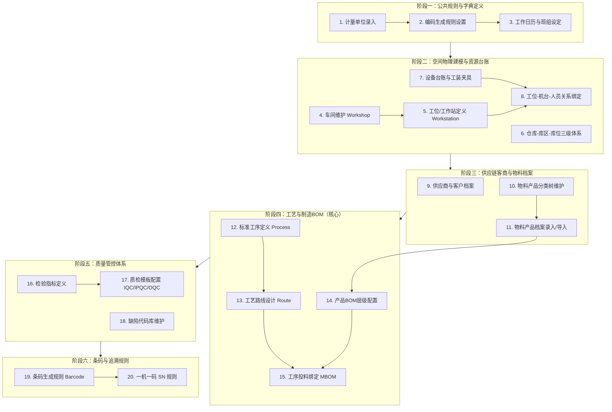

# 伺服与直驱数字化平台 — MES 物料分类与基础数据录入规范指南

**文档版本**：v1.0  
**适用对象**：MES 系统管理员、工艺工程师、生产计划员、仓管主管、数字化推进组  
**编制日期**：2026年9月  
**核心目标**：纠正德米萨 ERP 历史遗留的分类混淆问题，构建面向“精密直驱电机与运动控制系统”制造执行的标准物料分类体系，确立系统级基础数据录入拓扑与落地规程。

---

## 一、 为什么要重新梳理物料分类？

### 1.1 德米萨 ERP 历史分类痛点
目前公司运行的“德米萨 ERP”主要服务于**财务核算与基础进销存**，在制造执行（MES）视角下存在三大结构性硬伤：

1. **混淆了“采购原材料”与“车间自制半成品”**：
   - ERP 将车间自制的“电机线圈”（绕线、嵌线、浸漆件）直接放在“原材料”下，且存在同名重复分类。
   - **MES 冲突**：若物料定性为“原材料”，系统将视其为外购采购件，**无法为其编制制造 BOM、无法下发自制工单、无法追踪工位报工与工时**。
2. **缺乏“半成品（在制品 WIP）”关键层级**：
   - ERP 仅有“原材料”与“成品”两级，但直驱电机与平台模组的生产具有明显的中间状态（如定子总成、动子总成、PCBA驱动板、成品线束）。
   - **MES 冲突**：缺失半成品层级，导致无法实现多级工单拆解与工段流转卡跟踪。
3. **逻辑交叉与层级倒挂**：
   - 材质与功能混杂（如“钢管”、“外壳”并列）；
   - “平台模组”、“直线电机模组”作为高阶系统集成产品，被机械地堆在“电机”分类下，导致 BOM 嵌套关系混乱。

### 1.2 ERP 与 MES 的分类定位分工
* **德米萨 ERP（管理资产与财务）**：关注物料成本核算、采购价格、销售出入库；
* **自研 MES（管理制造执行）**：关注物料的**制造属性（自制/外购）、装配层级、工艺路线、工序投料点、批次与一机一码 SN 追溯**。

---

## 二、 MES 物料产品全景分类架构（推荐标准）

系统根节点为 `物料产品分类`，底层根据系统代码设计，严格划分为 **“物料 (ITEM)”** 与 **“产品 (PRODUCT)”** 两大核心支柱：

```text
物料产品分类（根节点 ITEM_TYPE_0000）
│
├── 1. 原材料（标识：物料 ITEM）
│   ├── 电子元件 ──────── 芯片阻容、PCB板
│   ├── 电气传感 ──────── 漆包线、光栅码盘、线缆生料
│   ├── 机加五金 ──────── 轴承、磁铁、铁芯冲片、外壳端盖、转轴机加、型材管料、导轨标件
│   ├── 胶水绝缘 ──────── 胶水、绝缘材料
│   └── 包装辅料 ──────── 纸箱泡棉、标贴铭牌、低值耗材
│
└── 2. 产品（标识：产品 PRODUCT）
    ├── 2.1 半成品（车间自制/组件）
    │   ├── 直线组件 ──── 动子总成、定子磁轨
    │   ├── 旋转组件 ──── 定子总成、转子总成
    │   ├── PCBA板 ────── 驱动板、读数头板、细分板
    │   ├── 自制线束 ──── 动力线、反馈线
    │   └── 光栅组件 ──── 光栅环、读数头
    │
    └── 2.2 产成品（整机/外售套件）
        ├── 电机 ──────── 伺服电机、DD马达(整机/动定子套件/定子线圈)、直线电机(整机/动子/定子)、音圈电机、磁弹簧
        ├── 模组平台 ──── 直线模组、丝杆模组、平台模组
        ├── 驱动系统 ──── 驱动器、细分盒
        ├── 编码器 ────── 圆光栅、光栅尺、圆磁环、磁栅尺、编码器工具(安装块/压块/限位/零位)
        └── 成品线缆 ──── 动力延长线、反馈延长线
```

---

## 三、 德米萨 ERP 与 MES 分类 1:1 映射字典表

在历史数据迁移与日常录入时，各部门请遵照以下映射标准执行归类：

### 3.1 原材料分支（标识：【物料】）

| 德米萨 ERP 原分类 | MES 规范一级分类 | MES 规范二级分类 | 典型物料示例 | 核心管理属性 |
| :--- | :--- | :--- | :--- | :--- |
| **电子元件 > 电子元器件** | 原材料 | 电子元器件 > 芯片与贴片料 | 驱动IC、MCU、电容、电阻、光耦、MOS管 | 开启批次，部分高值 |
| **电子元件 > PCB板** | 原材料 | 电子元器件 > PCB裸板 | 驱动器光板、读数头未贴片PCB板 | 开启批次 |
| **电机线圈（原材料）** | *【错误归类，纠正见半成品】* | *【移入产品/半成品】* | 漆包线属于原料，绕线完工件属于自制半成品 | 详见半成品映射 |
| **线缆（原材料）** | 原材料 | 电气与传感 > 电缆生线与连接器 | 成卷屏蔽电缆、动力裸线、航插接插件、端子 | 开启批次（按卷管理） |
| **磁铁** | 原材料 | 机械与五金 > 磁钢/永磁体 | 钕铁硼磁钢、铁氧体磁瓦 | 开启批次（按进货批） |
| **轴承** | 原材料 | 机械与五金 > 轴承类 | 深沟球轴承、高精度角接触轴承 | 开启批次，高值物料 |
| **外壳** | 原材料 | 机械与五金 > 电机机壳与端盖 | 铝机壳、前法兰、后端盖、接线盒壳体 | 批次管理 |
| **机加件** | 原材料 | 机械与五金 > 转轴与定制机加件 | 电机转轴、压板、固定块、过渡连接块 | 批次管理 |
| **钢管、铝型材、钢带** | 原材料 | 机械与五金 > 棒材型材原材料 | 调质圆钢、铝挤压型材、不锈钢带（机加原料） | 普通物料（按米/kg） |
| **导轨** | 原材料 | 机械与五金 > 导轨与标准件 | 模组直线滚珠导轨、滑块、螺钉、卡簧、销钉 | 开启安全库存预警 |
| **胶水** | 原材料 | 化工与绝缘 > 灌封胶水与绝缘材料 | 磁钢结构胶、环氧灌封胶、定子含浸绝缘漆 | 开启批次（管理保质期） |
| **包装材料** | 原材料 | 包装辅料 | 外包装瓦楞纸箱、EPE珍珠棉、防静电袋、铭牌 | 普通物料（不开批次） |
| **低值易耗品** | 原材料 | 包装辅料 > 车间辅助耗材 | 耐高温胶带、黄油润滑脂、无尘布、焊锡丝 | 普通物料（按总数领料） |

### 3.2 产品分支（标识：【产品】）

| 德米萨 ERP 原分类 | MES 规范一级分类 | MES 规范二级分类 | 包含的核心产品/型号 | 核心控制逻辑与追溯 |
| :--- | :--- | :--- | :--- | :--- |
| **电机线圈（原ERP误放）** | 产品 > 半成品 | 电机自制件 > 定子总成 | 60/80/130 绕线嵌线定子、直线电机动子线圈 | 强制配置BOM，开启批次 |
| **直线电机 > 动子** | 产品 > 半成品 / 产成品 | 直线电机组件 > 动子总成 | 各规格直线电机动子总成（自制件/备件销售） | 强制配置BOM，一机一码SN |
| **直线电机 > 定子** | 产品 > 半成品 / 产成品 | 直线电机组件 > 定子磁轨 | 直线电机定子（含磁钢定子轨，可独立外售） | 强制配置BOM，批次或米数流水 |
| *（车间加工线束）* | 产品 > 半成品 | 自制成品线束 | 焊接端子与航插后的动力线束、编码器反馈线束 | 强制配置BOM，批次管理 |
| **电机 > 伺服电机** | 产品 > 产成品 | 直驱与伺服电机 > AC伺服电机 | 60/80/110/130/180 全系列交流旋转伺服电机 | 强制配置BOM，**一机一码SN** |
| **电机 > DD马达** | 产品 > 产成品 | **直驱与伺服电机 > DD马达整机** | ICR 系列带外壳与高精度轴承的整机（单位：台） | 强制配置BOM，**一机一码SN** |
| **电机 > DD马达** | 产品 > 产成品 | **直驱与伺服电机 > 无框力矩电机(动定子套件)** | `ICR-40-0485 动定子` 等成套外售组件（单位：套） | 强制配置BOM，组件SN追溯 |
| **电机 > DD马达** | 产品 > 产成品 | **直驱与伺服电机 > 定子/线圈外售散件** | `ICR-40-0485 定子`、`ICR-40-0485 线圈`（外售散件） | 强制配置BOM，批次管理 |
| **电机 > 直线电机** | 产品 > 产成品 | 直驱与伺服电机 > 直线电机整机 | 有铁芯/无铁芯成套直线电机整机 | 强制配置BOM，**一机一码SN** |
| **电机 > 直线电机 > 动子**| 产品 > 产成品 / 半成品 | 直驱与伺服电机 > 直线电机动子(外售) | 单独外售或作为模组组件的动子总成 | 强制配置BOM，一机一码SN |
| **电机 > 直线电机 > 定子**| 产品 > 产成品 / 半成品 | 直驱与伺服电机 > 直线电机定子磁轨(外售) | 单独外售或作为模组组件的定子磁轨（按米/段） | 强制配置BOM，批次流水号 |
| **电机 > 音圈电机** | 产品 > 产成品 | 直驱与伺服电机 > 音圈电机 | VCM 摆动音圈电机、圆柱形高频直线音圈电机 | 强制配置BOM，**一机一码SN** |
| **电机 > 磁弹簧** | 产品 > 产成品 | 直驱与伺服电机 > 磁弹簧配件 | 磁力无接触平衡机构、重力补偿组件 | 强制配置BOM，批次管理 |
| **电机 > 模组/平台** | 产品 > 产成品 | 精密运动模组与平台 | 单轴直线滑台、XY精密对位台、龙门双驱模组 | **高阶BOM（嵌套电机/光栅）** |
| **编码器 > 圆光栅** | 原材料 | 电气与传感 > 编码器散件与光栅盘 | `玻璃码盘`（直径12.4/26/35.9等）、`镀铬码盘`、`玻璃光栅` | **外购光学原料**（正库存） |
| **编码器 > 圆光栅** | 产品 > 半成品 | **编码器自制组件 > 光栅环与码盘总成** | `光栅环(IESR17)`、`ICDM-11-256` 码盘贴装校准总成 | **车间自制装配件**（负库存纠偏） |
| **编码器 > 圆光栅** | 产品 > 产成品 | **编码器与传感 > 圆光栅编码器(整机)** | `IESR17-1Vpp`、`OE16-8W`、`ORD130-150` 等整套出厂编码器 | 强制配置BOM，**高值物料，唯一SN** |
| **编码器 > 磁栅/光栅尺** | 产品 > 产成品 | 编码器与传感 > 光栅尺/磁栅尺系统 | 包含标尺条与读数头的成套测量系统 | 强制配置BOM，**高值物料，唯一SN** |
| **编码器 > 细分盒/驱动器**| 产品 > 产成品 | 驱动与控制系统 | 伺服驱动器整机、光栅插补细分器整机 | 强制配置BOM，**一机一码SN** |
| **编码器 > 编码器工具** | 产品 > 产成品 | 编码器与传感系统 > 调试工具箱 | 对外随产品附赠或销售的零位调校盒、标定套件 | 强制配置BOM |
| **编码器 > 母版费(杂项)** | *【非实物虚拟物料】* | *【不纳入MES物理物料】* | `ICDM-30-带孔母版费` 等供应商光刻开模费用 | 财务费用报销/服务项，不排产不入库 |

---

## 四、 MES 基础数据录入的【6 阶段黄金顺序】

基础数据录入必须严格按照以下先后顺序推进，不可倒置：



### 4.1 详细录入指引

#### 阶段 1：公共规则与字典定义
1. **计量单位**（`md/unitmeasure`）：
   - 必须先录入计量单位，否则后续无法录入物料。
   - **红线**：单位名称必须与德米萨 ERP 完全对齐（如 `台`、`个`、`套`、`件`、`m`、`kg`、`卷`）。
2. **编码生成规则**（`md/autocode`）：
   - 配置工单号（`MO-`）、批次号（`LOT-`）、SN 码、调拨单号的自动流水号规则。
3. **工作日历与班组**（`cal/team`, `cal/calendar`）：
   - 录入早班、中班、常白班的工作时间段与节假日，排程与工时统计依赖此数据。

#### 阶段 2：空间物理建模与资源台账
4. **车间与工位**（`md/workshop` ➔ `md/workstation`）：
   - 车间示例：`电机车间`、`模组车间`、`电控车间`。
   - 工位示例：`定子绕线工位`、`嵌线工位`、`浸漆工位`、`电机总装工位`、`综合性能测试工位`、`模组装配工位`、`出厂包装工位`。
5. **仓库三级体系**（`wm/warehouse` ➔ `location` ➔ `area`）：
   - 必须规划三级：`仓库` ➔ `库区` ➔ `库位`。
   - **关键设置**：必须建立**“车间线边仓”**（或在线在制暂存区），原料领出后暂存在线边仓，工人报工时扣减线边仓物料。
6. **设备与工装**（`dv/machinery`, `tm/tool`）：
   - 录入自动绕线机、充磁机、动平衡机、出厂综合测试台等资产。
   - 在工位设置中，将【设备】和【责任员工】关联到指定工位。

#### 阶段 3：供应链客商与物料档案
7. **客商档案**（`md/vendor`, `md/client`）：
   - 从德米萨 ERP 导出供应商和客户数据，直接使用系统内置的 Excel 模板批量导入。
8. **物料分类树**（`md/item/type`）：
   - 按照本文第二部分确立的标准结构逐级录入。
   - **核心注意**：所有原料选【物料】，自制半成品和成品选【产品】。
9. **物料档案**（`md/item`）：
   - 物料编码必须 100% 沿用德米萨 ERP 编码。
   - 核心参数规范：
     - **批次管理（`batchFlag`）**：芯片、磁钢、轴承、漆包线、半成品必须勾选。
     - **高值物料（`highValue`）**：编码器、驱动芯片、成品电机必须勾选。
     - **安全库存（`safeStockFlag`）**：紧缺外购件设置上限与下限报警值。

#### 阶段 4：工艺路线与制造 BOM（MBOM）
10. **工序维护**（`pro/process`）：
    - 严禁过度拆解细小操作。第一期以**关键质量检验点与物理流转节点**为主：
      - 工序10：定子绕线与嵌线
      - 工序20：绝缘浸漆与烘干
      - 工序30：转子压轴与动平衡
      - 工序40：整机总装配
      - 工序50：出厂性能终检（耐压/反电势/空载电流）
      - 工序60：铭牌贴标与包装
11. **工艺路线**（`pro/route`）：
    - 串联上述工序，指定每道工序的执行工位与标准节拍工时。
12. **产品 BOM 与工序投料**（`md/product_bom`, `pro/route_product_bom`）：
    - 配置产品或半成品的子件构成；
    - **制造投料绑定**：明确指定哪个原料在哪道工序投入（如：轴承在工序40总装投入，包装箱在工序60包装投入）。

#### 阶段 5：质量管控标准
13. **质检标准建立**（`qc/indicator`, `qc/template`）：
    - **IQC 来料检验模板**：针对磁钢（高斯值）、漆包线（线径/耐温）、轴承（公差/异音）；
    - **IPQC 过程检验模板**：浸漆后绝缘电阻测试；
    - **OQC 出厂检验模板**：电机综合出厂指标判定。
14. **缺陷代码库**（`qc/defect`）：如绝缘击穿、动平衡超标、引线划伤、螺丝滑牙等。

#### 阶段 6：条码与追溯规则
15. **条码与 SN 规则**（`wm/barcode`, `wm/sn`）：
    - 为直驱电机、模组平台配置唯一的出厂序列号（一机一码）。

---

## 五、 伺服与直驱行业 4 大落地实施避坑守则

### 守则 1：直线电机“动子 / 定子”的独立编码机制
* 直线电机的动子（线圈体）和定子（磁轨）必须具有**独立的物料编码**；
* 动子与定子均归在 `产品 (PRODUCT)` 分类下，各自拥有独立的 BOM、工艺路线与检测模板；
* 当整台直线电机出货时，整机 BOM 下挂【动子】与【定子】；当客户单独加订 2 米磁轨时，直接下发定子生产工单。

### 守则 2：多层嵌套 BOM 的自动工单拆解
* 平台模组（Stage）是最高层级：
  ```
  【XY对位平台模组】（工单 1）
   ├── 【直线电机动子】（工单 2）── 消耗 漆包线 + 动子铁芯 + 灌封胶
   ├── 【直线电机定子】（工单 3）── 消耗 磁轨钢板 + 钕铁硼磁钢 + 磁钢胶
   ├── 【光栅尺读数头系统】（外购/组装）
   ├── 【高精度导轨】（外购领料）
   └── 【大理石/铝合金底座】（机加件外购/自制）
  ```
* 规范分类与多层 BOM 建立后，计划员在 MES 下达 1 台平台模组计划，系统可自动倒推计算各级组件的制造工单与采购需求。

### 守则 3：严控“一机一码 SN”的打码范围
* **必须开 SN 的对象**：伺服电机整机、DD马达整机、直线电机动子、模组平台、光栅尺、伺服驱动器。
* **按批次（LOT）管理的对象**：漆包线（卷批）、磁钢（炉批）、轴承（进货批）、绝缘胶水（保质期批次）。
* **不开批次不开 SN 的对象**：普通螺丝、平垫、扎带、纸箱。严禁给紧固件开启批次扫码，避免车间一线报工崩溃。

### 守则 4：物料编码与 ERP 的 100% 绝对一致红线
* 严禁在 MES 里自创一套新的物料编码！
* 德米萨 ERP 的编码是后续数据接口、完工入库写回、大屏联动的唯一身份标识。若发现 ERP 中存在“一物多码”或编码混乱，必须**先在 ERP 端完成清理，再导入 MES**。

---

## 六、 总结与执行行动项

| 步骤 | 任务内容 | 责任人 | 产出物 |
| :---: | :--- | :---: | :--- |
| **第一步** | 登录 MES 后台，按本文第二部分重构【物料产品分类树】 | MES 系统管理员 | 规范的物料分类树 |
| **第二步** | 维护计量单位、自动编码规则、车间与工位设置 | 工艺部 / 数字化推进组 | 工位与车间物理建模 |
| **第三步** | 从德米萨 ERP 导出最新物料明细，按分类映射表整理 Excel | 仓管部 / 计划部 | 《标准化物料主数据导入表》 |
| **第四步** | 批量导入物料，配置关键件批次开关与安全库存 | 数字化推进组 | 基础物料库建档完成 |
| **第五步** | 选取 1~2 款主力产品（如 130 伺服电机或主力直线电机）打通完整 BOM 与工艺路线 | 工艺工程师 | 首批产品制造 BOM 与工艺闭环 |
