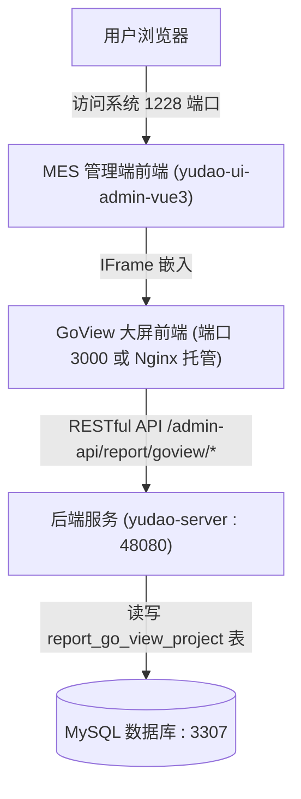

# MES 系统 - 大屏设计器 (GoView) 架构原理与开发部署指南

## 一、模块定位与技术架构

在系统【报表管理】目录下，共包含三种不同类型的可视化工具：

| 功能模块 | 对应菜单路径 | 底层技术实现 | 部署与运行形态 |
|---|---|---|---|
| **报表设计器** | `/report/jimu-report` | 积木报表 (JimuReport) | 直接作为 Jar 包内嵌在 Spring Boot 后端 (`yudao-server`) 中运行，开箱即用 |
| **仪表盘设计器** | `/report/jimu-bi` | 积木 BI (JimuBI) | 同样由积木报表 Jar 包内嵌提供，开箱即用 |
| **大屏设计器** | `/report/go-view` | **GoView** (低代码数据可视化大屏开发平台) | **独立的 Vue 3 前端工程**，管理后台通过 `<iframe>` 标签跨域嵌入 |

### 架构拓扑与数据流向



---

## 二、常见报错：“127.0.0.1 拒绝连接” 根因解析

### 1. 现象
进入【报表管理】 $\rightarrow$ 【大屏设计器】时，页面内容区白屏并显示浏览器原生错误：`127.0.0.1 拒绝连接。 (ERR_CONNECTION_REFUSED)`。

### 2. 根因
查看主工程前端源码 [`yudao-ui-admin-vue3/src/views/report/goview/index.vue`](file:///d:/mes/mes/yudao-ui/yudao-ui-admin-vue3/src/views/report/goview/index.vue)：
```vue
<template>
  <doc-alert title="大屏设计器" url="https://doc.iocoder.cn/report/screen/" />
  <ContentWrap :bodyStyle="{ padding: '0px' }" class="!mb-0">
    <IFrame :src="src" />
  </ContentWrap>
</template>
<script lang="ts" setup>
import { getAccessToken, getRefreshToken } from '@/utils/auth'

defineOptions({ name: 'GoView' })

const src = ref(
  `${import.meta.env.VITE_GOVIEW_URL}?accessToken=${getAccessToken()}&refreshToken=${getRefreshToken()}`
)
</script>
```
而在各环境配置文件中（如 `.env.local`、`.env.prod`），默认配置为：
```properties
VITE_GOVIEW_URL='http://127.0.0.1:3000'
```
**GoView 属于独立前端项目，默认未随 MES 管理端一起构建，也未包含在默认基础 Docker 容器编排中**。由于当前宿主机没有启动运行在 3000 端口的 GoView 前端工程，浏览器向 `127.0.0.1:3000` 发起 iframe 请求自然会被连接拒绝。

---

## 三、后端接口与数据库表准备（已全部就绪）

### 1. 后端 API 接口
后端模块 `yudao-module-report-server` 已原生内置了 GoView 的服务端支持：
* **项目管理**：`cn.iocoder.yudao.module.report.controller.admin.goview.GoViewProjectController`
  - `/admin-api/report/goview/project/create`（新建大屏项目）
  - `/admin-api/report/goview/project/update`（保存大屏画布配置 JSON）
  - `/admin-api/report/goview/project/my-page`（大屏分页列表）
  - `/admin-api/report/goview/project/get`（读取指定大屏元数据与内容）
  - `/admin-api/report/goview/project/delete`（删除大屏）
* **数据源与 SQL 执行**：`cn.iocoder.yudao.module.report.controller.admin.goview.GoViewDataController`
  - `/admin-api/report/goview/data/by-sql`（执行 SQL 获取动态图表数据）
  - `/admin-api/report/goview/data/by-http`（通过 HTTP 代理获取外部 API 数据）

### 2. 数据库持久化表
GoView 核心表为 `report_go_view_project`，表结构 DDL 如下（当前已在 Docker 容器数据库 `mes-mysql` 中创建完毕）：
```sql
CREATE TABLE IF NOT EXISTS `report_go_view_project` (
  `id` bigint NOT NULL AUTO_INCREMENT COMMENT '项目编号',
  `name` varchar(255) NOT NULL COMMENT '项目名称',
  `pic_url` varchar(512) DEFAULT NULL COMMENT '预览封面图片 URL',
  `content` longtext COMMENT '大屏画布与组件配置（JSON 格式）',
  `status` int NOT NULL COMMENT '发布状态 (0: 已发布, 1: 未发布)',
  `remark` varchar(512) DEFAULT NULL COMMENT '项目备注',
  `creator` varchar(64) DEFAULT '' COMMENT '创建者',
  `create_time` datetime NOT NULL DEFAULT CURRENT_TIMESTAMP COMMENT '创建时间',
  `updater` varchar(64) DEFAULT '' COMMENT '更新者',
  `update_time` datetime NOT NULL DEFAULT CURRENT_TIMESTAMP ON UPDATE CURRENT_TIMESTAMP COMMENT '更新时间',
  `deleted` bit(1) NOT NULL DEFAULT b'0' COMMENT '是否删除',
  PRIMARY KEY (`id`) USING BTREE
) ENGINE=InnoDB DEFAULT CHARSET=utf8mb4 COLLATE=utf8mb4_unicode_ci COMMENT='GoView 大屏项目表';
```

---

## 四、本地联调与启动步骤 (开发阶段)

若要在本机开发或调试大屏功能，只需单独启动 GoView 前端工程：

### 1. 克隆官方适配的 GoView 源码
在 MES 工程同级目录打开终端执行：
```bash
git clone https://gitee.com/zhijiantianya/yudao-ui-go-view.git
cd yudao-ui-go-view
```

### 2. 安装依赖并检查配置
```bash
pnpm install
```
检查 `yudao-ui-go-view` 根目录下的 `.env.development` 配置，确认后端 API 代理地址与当前后端一致：
```properties
# 后端 API 地址（默认指向本地 48080）
VITE_DEV_PATH = 'http://localhost:48080/admin-api'
```

### 3. 启动开发服务器
```bash
pnpm dev
```
控制台将输出启动信息，默认监听在：
```text
  > Local: http://localhost:3000/
```

### 4. 验证效果
重新在浏览器中访问 MES 管理后台 `http://localhost:1228`，点击【报表管理】 $\rightarrow$ 【大屏设计器】：
* iframe 会自动加载 `http://127.0.0.1:3000` 并传入当前用户的 `accessToken`。
* GoView 会自动完成免密单点登录，成功展示大屏工作台。

---

## 五、生产环境与 Docker 容器化部署方案 (上线阶段)

若后续需要将大屏设计器一同打包交付至工控机或服务器，推荐以下两种部署策略：

### 方案 A：集成到现有 Nginx（推荐，最省资源）
无需增加新容器，直接将 GoView 作为静态资源托管在现有的 `mes-frontend` 容器中：
1. **打包静态文件**：
   在 `yudao-ui-go-view` 下执行 `pnpm build`，生成 `dist` 目录。
2. **静态托管与代理**：
   将编译产物拷贝到 `docker/frontend/goview/`，并在 `docker/frontend/nginx.conf` 中追加路由：
   ```nginx
   # 大屏设计器静态页面
   location /goview/ {
       alias /usr/share/nginx/html/goview/;
       try_files $uri $uri/ /goview/index.html;
   }
   ```
3. **修改管理端前端环境变量**：
   在 `yudao-ui-admin-vue3/.env.prod` 中将大屏地址改为同源相对路径或网关地址：
   ```properties
   VITE_GOVIEW_URL='/goview/'
   ```

### 方案 B：独立 Docker 容器编排
将 GoView 独立构建为一个轻量级 Nginx 容器，在 `docker-compose.yml` 中挂载：
```yaml
  mes-goview:
    image: nginx:alpine
    container_name: mes-goview
    restart: always
    ports:
      - "3000:80"
    volumes:
      - ./goview/dist:/usr/share/nginx/html:ro
    networks:
      - mes-net
```

---

## 六、如果项目暂不需要大屏设计器的处理方案

若当前 MES 车间系统主要依赖工单、扫码、物料管理与积木报表打印，暂时用不到 GoView 大屏：
1. 登录管理员账号，进入 **【系统管理】 $\rightarrow$ 【菜单管理】**。
2. 搜索 `大屏设计器`（对应路由 `go-view`）。
3. 点击【编辑】，将 **“显示状态”** 设为 `隐藏`，或将 **“菜单状态”** 设为 `停用`。
4. 隐藏后左侧菜单不再展示该项，对系统的正常运行无任何负面影响。
