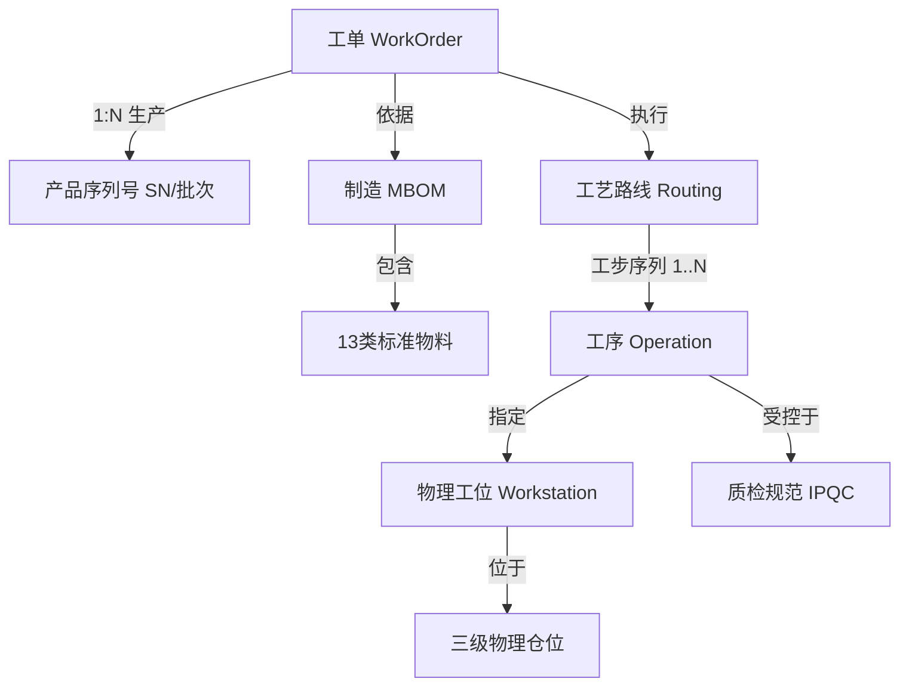
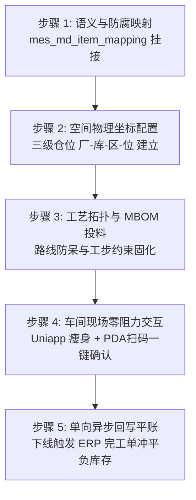
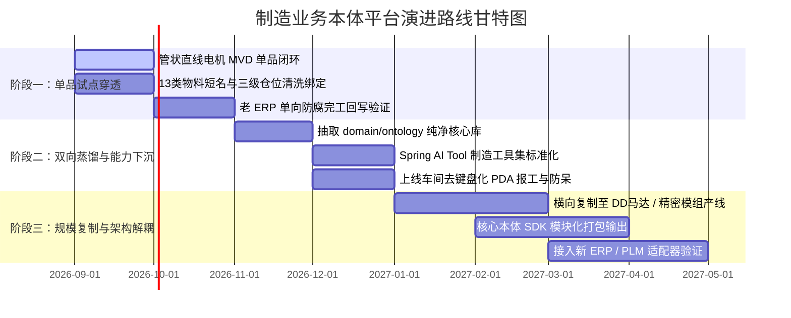

# 离散制造业务本体 (Ontology) 平台架构与演进实施方案

> **文档定位**：企业级制造业务本体（Manufacturing Ontology）全景技术架构设计、架构分歧客观辩证与落地实施路径方案。  
> **适用场景**：伺服电机、直驱电机（DD马达/管状直线电机）、精密模组与伺服驱动器高端离散制造场景。  
> **核心使命**：跨越 ERP、MES、WMS 系统孤岛，建立企业唯一的“数字世界模型”，支撑车间零阻力人机协同，并为工业 AI（Agent）提供可落地的真实物理操作底座。

---

## 一、 方案概述与核心战略价值

### 1.1 传统工业信息化痛点与系统死结
在传统离散制造工厂中，企业往往部署了 ERP（如德米萨）、MES、WMS 以及各类工控机软件，但普遍陷入以下死结：
1. **数据孤岛与语义断层**：老 ERP 关注财务与采购凭证，MES 关注工位过站实绩，WMS 关注仓储账目。同一物料在 ERP 叫“物料编码 A”，在工艺图纸叫“图号 B”，在车间工人口中叫“简称 C”，导致系统间语义互不相通。
2. **账实脱节与负库存黑洞**：由于系统集成依靠点对点接口或人工二次补录，物理工位已经装配完工，ERP 账面尚未入库；或退料未同步，造成大量账面结存为负（如历史摸底中 DD马达结存 `-3945` 件），彻底摧毁了排产计划的置信度。
3. **AI 落地沦为玩具 Demo**：大模型无法直接面对企业内部数十张复杂、脏乱且外键缺失的底层 SQL 数据表，缺少制造物理约束上下文，产生严重业务幻觉，无法执行可靠的生产决策。

### 1.2 制造业务本体（Ontology）本质解构
**制造业务本体（Manufacturing Ontology）不是简单的数据中台、ETL 工具或消息流转管道，而是物理工厂在数字空间的“全要素语义与动势中枢”。**

| 维度 | 普通系统集成 / 数据流转中间件 (ETL/MQ) | 制造业务本体 (Manufacturing Ontology) |
| :--- | :--- | :--- |
| **管理对象** | **管理死数据 (Data)**<br>只关注字段映射（如 ERP `f_code` $\to$ MES `mat_id`），把字节从 A 库搬到 B 库。 | **管理活实体 (Object)**<br>物理现实的真实镜像（如管状电机定子、三级仓位坐标、工位能力），内嵌物理规律与约束。 |
| **运行机制** | **被动同步 (Passive Sync)**<br>单据变了就触发同步，不管业务时序是否颠倒（垃圾进、垃圾流转）。 | **动势驱动 (Action & State Machine)**<br>现场所有操作必须通过标准 Action（如扫码报工、调拨）驱动状态机，强拦截不合规动作。 |
| **服务对象** | **给程序员写代码看**<br>产物是一堆数据管道与宽表，现场工人和 AI 面对这些表依然寸步难行。 | **给现场工人与 AI 协同操作**<br>向上封装为 Spring AI `@Tool` 供大模型决策，向下封装为 PDA 一键确认大按钮。 |

### 1.3 人在回路（Human-in-the-Loop）人机协同范式

制造现场的物理现实决定了：**代码和算法不能替代工人拧螺丝，但可以消除工人与管理者的认知负荷**。本体平台建立了清晰的人机协同边界：

```
                   ┌────────────────────────────────────────┐
                   │               人类 (Human)             │
                   │   物理执行（搬货/装配） + 决策确认（点确认）  │
                   └──────────────────▲─────────────────────┘
                                      │ 1. 扫码汇报物理动作 / 3. 一键审批执行
                                      ▼
                   ┌────────────────────────────────────────┐
                   │             AI 智能中枢 (Agent)         │
                   │   全局统筹、排产试算、异常求解、拟定动作建议   │
                   └──────────────────▲─────────────────────┘
                                      │ 调用 Tool 读取真实世界 / 触发 Action
                                      ▼
┌─────────────────────────────────────────────────────────────────────────────────┐
│                           制造业务本体 (Ontology)                                │
│   【统一数据与物理映射】: 13 类极简物料 + 三级物理仓位 + 工艺约束路线                    │
│   【链接与防腐底层系统】: 德米萨老 ERP (进销存财务) ⟷ MES (工位实绩) ⟷ WMS (物理空间)   │
└─────────────────────────────────────────────────────────────────────────────────┘
```

* **物理现实**：永远由现场工人执行（领料、搬运、装配），数据负责忠实反映现实；
* **数字世界**：AI 基于本体模型的全局拓扑，进行毫秒级排产试算与防呆推演；
* **高维闭环**：人类退居高维确认层，所有 AI 决策通过 PDA 上的“一键确认大按钮”受控执行。

### 1.4 核心管理与经济回报（ROI 穿透）

```
                         ┌──────────────────────────────────────────────────┐
                         │               经营管理投资回报 (ROI)              │
                         └─────────────────────────┬────────────────────────┘
                 ┌─────────────────────────────────┼─────────────────────────────────┐
                 ▼                                 ▼                                 ▼
       【资产复利与边际成本】            【库存与交付确定性】              【工业质量与人效】
  · 产线接入成本递减 70%           · 负库存彻底清零 (100%)           · 车间去键盘化，操作提速 60%
  · 消除异构系统网状接口重构       · 齐套试算由 4 小时压缩至秒级     · 工序防呆拦截率 100%
  · 沉淀自主可控工业数字模型        · 生产异常响应由小时级降至分钟级  · 一机一码全链路双向 100% 穿透
```

---

## 二、 核心架构争鸣：要不要做独立平台？（客观辩证与工程破局）

### 2.1 理论图纸上的诱惑：为什么想做独立 Ontology 平台？
在系统架构设计初期，很多技术团队常有一种理想化冲动：
> *“既然要统一业务语义，为什么不一步到位，单独搭建一套独立的微服务平台或 Ontology 中台？向上对接 MES，向下对接 ERP，未来无论更换什么 ERP 或 MES，这套平台都能即插即用、无缝复用！”*

在计算机理论图纸上，这是极具诱惑力的“标准中介者模式（Mediator Pattern）”。然而，在严肃离散制造工程实践中，过早追求独立的物理运行平台存在 **4 大致命硬伤**。

### 2.2 独立平台的四大致命硬伤客观剖析

#### 1. 陷入 YAGNI 假想敌陷阱（为极低概率事件买单）
- 企业当前全力推进自研 MES，这个 MES 系统本身就是企业正在倾力打造的核心资产与数字底座；
- 退一万步讲，即便 5 年后企业耗费数百万采购西门子（Opcenter）或达索（DELMIA）等商业成熟 MES，此类工业巨头拥有自己封闭严密的 ISA-95 专有数据模型，绝不可能去适配任何自研的外挂中台；
- 为了一个“未来可能更换 MES”的假设，在当前研发初期凭空增加一个中间系统的物理成本，是典型的过度工程化（Over-Engineering）。

#### 2. 车间毫秒高并发与分布式网络的致命冲突
- 离散制造流水线要求工人扫码枪扫码后，系统必须在 **200 毫秒以内** 完成工序防呆校验、更新在制品流转卡并联动气缸抬起；
- 若拆分出独立的物理平台，交互链路拉长为：`PDA 终端` $\to$ `自研 MES` $\to$ `跨网络 HTTP/gRPC 调用` $\to$ `Ontology 平台处理` $\to$ `跨网络回传 MES` $\to$ `MES 写本地库`；
- 车间现场 Wi-Fi 信号极易受到机床、大功率变频器电磁干扰，稍有网络抖动或丢包，整条产线瞬间停滞；一旦独立平台宕机，全厂陷入瘫痪，且带来分布式事务回滚与重试风暴的灾难。

#### 3. “到底谁是主数据”的双重真相源管理灾难
- 独立平台意味着必须配套：独立的数据表、独立的用户认证系统、独立的物料建档 UI 页面与审批工作流；
- 现场业务人员建一个新物料，要在 ERP 录一次、Ontology 录一次、MES 录一次；系统维护者需要维护两套系统的前后端，外加一套双向同步管道，直接将研发精力耗死在无意义的基建泥潭中。

#### 4. 角色定位错位（Palantir 是局外人，而我们是内部造城者）
- 硅谷巨头 Palantir（Foundry）之所以必须做独立 Ontology 平台，是因为它是第三方独立软件服务商，客户的 SAP、Oracle 早已上线且严禁第三方修改底库，Palantir 只能在外部架设只读挂件；
- 而企业内部核心研发团队是系统唯一的**主导造城者**，MES 系统本身就是工厂现场的唯一大脑，制造本体天然就应该生长在系统内部！

### 2.3 终极破局法则：“运行时单体，代码态平台”（Runtime Monolith, Code-level Platform）

为了彻底兼顾“车间一线微秒级响应、断网自治的工业零容错”与“系统架构的高可复用性与平台级纯洁度”，本项目确立最高工程准则：

> **“在物理部署上，死守单体架构（零网络延迟，断网自治，本地极简运维）；  
> 在代码设计上，坚守平台级纯洁度（严格分层解耦，高内聚低耦合，随时可拆）。”**

```
┌────────────────────────────────────────────────────────────────────────┐
│             物理部署态：运行时单体 (Runtime Monolith)                    │
│                                                                        │
│   同一 JVM 进程 / 同一本地 MySQL 事务 / 微秒级内存直调 / 断网 100% 自治   │
│   ┌────────────────────────────────────────────────────────────────┐   │
│   │  MES 业务流转 (yudao-module-mes)                                │   │
│   │         │                                                      │   │
│   │         ▼ 本地方法直接调用 (微秒级)                            │   │
│   │  制造本体中枢 (domain/ontology: 实体/关系/动势状态机)          │   │
│   │         │                                                      │   │
│   │         ▼ 适配器翻译 (无跨网络损耗)                            │   │
│   │  防腐映射层 (infrastructure/acl: mes_md_item_mapping)          │   │
│   └────────────────────────────────────────────────────────────────┘   │
└────────────────────────────────────────────────────────────────────────┘
                                    │
                                    │ 抽象解耦、代码依赖单向
                                    ▼
┌────────────────────────────────────────────────────────────────────────┐
│              设计代码态：通用平台级 SDK (Code-level Platform)           │
│                                                                        │
│  · 核心领域模型（Item, Routing, Workstation, Action）保持 100% 纯洁     │
│  · 坚决不在核心业务表中添加任何老 ERP 或外部系统专有字段                │
│  · 核心包随时可独立打包为 industrial-ontology-core.jar 移植至新系统     │
└────────────────────────────────────────────────────────────────────────┘
```

---

## 三、 总体架构设计 (Overall Architecture)

平台采取“向下防腐隔离、中枢语义建模、向上赋能应用”的三层解耦架构：

```
┌────────────────────────────────────────────────────────────────────────────────────────┐
│                          第三层：人机协同与智能应用层 (Application & Copilot)           │
│                                                                                        │
│   ┌─────────────────────┐    ┌─────────────────────┐    ┌──────────────────────────┐   │
│   │ 现场移动端 / PDA    │    │ 工业 AI 调度 Copilot│    │ 厂长经营管控驾驶舱       │   │
│   │ (扫码报工/一键确认) │    │ (齐套分析/冲突推演) │    │ (GoView 全要素数字孪生)  │   │
│   └──────────▲──────────┘    └──────────▲──────────┘    └────────────▲─────────────┘   │
└──────────────┼──────────────────────────┼────────────────────────────┼─────────────────┘
               │ 触发 Action              │ Spring AI @Tool 接口       │ 实时状态订阅
┌──────────────┴──────────────────────────┴────────────────────────────┴─────────────────┐
│                      第二层：制造业务本体中枢 (Manufacturing Ontology Core)              │
│                                                                                        │
│  【对象实体模型 Object】             【关系拓扑拓扑 Relation】       【动势与规则 Action】     │
│  · 13 类极简物料分类体系             · 树状多级 MBOM 结构           · [扫码报工过站]          │
│  · 空间四级仓位(厂-库-区-位)         · 工艺路线前后序拓扑           · [库位物料调拨]          │
│  · 工位-设备-工装三元组              · 工位能力与人员资质矩阵       · [质检放行与阻断]        │
│  · 批次与一机一码序列号 (SN)         · 质检标准与缺陷代码映射       · [完工单向回写平账]      │
│                                                                                        │
│  【规则看门狗 Invariant Rules】: 工序未检阻断 / 负库存拦截 / BOM 版本强校验            │
└─────────────────────────────────────────▲──────────────────────────────────────────────┘
                                          │ 本地事务与统一模型驱动
┌─────────────────────────────────────────┴──────────────────────────────────────────────┐
│                        第一层：异构系统接入与防腐层 (Connectors & ACL)                  │
│                                                                                        │
│   ┌───────────────────────┐   ┌────────────────────────┐   ┌───────────────────────┐   │
│   │ 德米萨老 ERP 适配器   │   │ 自研轻量 MES 执行引擎  │   │ 工业 IoT / 硬件连接器 │   │
│   │ (只读同步 + 异步冲销) │   │ (报工记录 / 工位状态)  │   │ (扫码枪 / PLC / 电子秤)│   │
│   └───────────────────────┘   └────────────────────────┘   └───────────────────────┘   │
└────────────────────────────────────────────────────────────────────────────────────────┘
```

---

## 四、 制造全域本体模型构建 (Ontology Models)

本体中枢由三大支柱构成：**实体（Object）**、**关系（Relation）**、**动势（Action）**。

### 4.1 实体模型（Object）：建立制造物理世界 SSOT

#### (1) 13 类极简物料分类体系（工位友好型短名）
彻底摒弃传统 ERP 内部冗长、易歧义的品名，在本体层统一建立 2~4 字的工位友好型标准短名（SSOT），所有外部系统编码在进入本体时完成映射绑定：
* **机加五金**：外壳、前盖、后盖、轴承、定子铁芯、动子铁芯、钢管、端子
* **电气传感**：漆包线、引出线、磁钢、霍尔板、插头、线圈、线缆
* **胶水绝缘**：环氧灌封胶、高温绝缘胶带、绝缘纸
* **电子元件**：芯片、阻容件、接插件
* **包装辅料**：纸箱、珍珠棉泡棉、防静电袋、产品铭牌
* **自制半成品**：直线动子组件、定子磁轴组件、旋转电机定子总成、PCBA驱动板
* **产成品**：管状直线电机整机、DD马达整机、精密滑台模组、伺服驱动器

#### (2) 空间四级物理仓位坐标模型
将车间离散空间建模为严格的坐标实体，杜绝物料在系统中处于“虚拟漂移”状态：
$$\text{Location Entity} = \text{工厂代码 (Factory)} \to \text{仓库 (Warehouse)} \to \text{库区 (Area)} \to \text{货位/货架 (Bin)}$$
* **线边库（WIP-BIN）**：与具体产线工位强绑定，物料进入即标记为工序准备就绪；
* **良品/待检/报废区（QC-BIN）**：具备严格的状态机物理准入准出规则，未检物料物理阻断流入下一道工序。

#### (3) 工位-设备-工装三元组模型
定义工位物理产能单元：
* `Station ID`：物理工位编号；
* `Device Bindings`：关联的机床、绕线机、充磁机或耐压测试台；
* `Operator Qualification`：操作该工位所需的技能等级与操作权限。

---

### 4.2 关系模型（Relation）：固化客观物理与工艺规律



1. **MBOM 齐套依赖**：工单与物料批次之间的消耗拓扑，明确关键物料的装配追溯级别（批次级 / 单件一机一码级）；
2. **工艺流转时序拓扑**：严格约束 $Step_{N}$ 的开工必须依赖 $Step_{N-1}$ 完工且质检合格，杜绝跳序、漏检流转；
3. **双向质量追溯图谱**：
   * **正向追溯**：供应商来料批次 $\to$ 原料检验记录 $\to$ 投产工单 $\to$ 成品电机 SN；
   * **反向追溯**：客户报修电机 SN $\to$ 生产班组与工位 $\to$ 耐压测试数据 $\to$ 关键零部件原始炉批号。

---

### 4.3 动势模型（Action）：定义系统业务状态机与物理闭环

本体中的每个 Action 都是一个原子事务，同时驱动物理状态校验与异构系统协同：

| 动作名称 (Action) | 输入参数 | 前置约束检验 (Invariants) | 触发的状态变迁与跨系统联动 |
| :--- | :--- | :--- | :--- |
| **`Action: IssueMaterial`**<br>(工单发料/配盘) | `workOrderId`<br>`binCode`<br>`lotNo` | 1. 对应库位物料状态为【合格】<br>2. 批次未过期，齐套试算无短缺 | 1. 扣减原料仓物理库存<br>2. 增加线边库在制品库存<br>3. 标记工单处于“物料齐套可投产”状态 |
| **`Action: StationConfirm`**<br>(工位扫码报工) | `snCode`<br>`stationId`<br>`workerId` | 1. 前道工序已完工且质检放行<br>2. 作业人员具备该工位操作资质<br>3. 防呆扫描匹配当前工序 BOM | 1. 变更工单/SN 流转卡工序状态<br>2. 记录工时绩效与工位首件质检<br>3. 自动扣减工位线边仓对应 BOM 配料 |
| **`Action: CompleteAndPutaway`**<br>(成品完工入库) | `snCode`<br>`targetBin` | 1. FQC 最终性能综合测试 100% 合格<br>2. 目标仓位属于成品良品区 | 1. 锁定成品 SN 并绑定入库物理货位<br>2. **单向防腐回写老 ERP**：生成完工入库单平账<br>3. 释放对应工单产能占用 |

---

## 五、 异构系统防腐层与平账机制 (Anti-Corruption Layer)

### 5.1 领域防腐原则：坚决不在主表加 `erp_code`
如果在核心表 `mes_md_item` 中直接添加 `erp_code` 字段，会导致三大恶果：
1. **污染核心领域模型**：通用 MES 会退化为针对德米萨 ERP 的特定外包定制系统，失去平台独立性；
2. **扩展性彻底锁死**：未来接入 PLM（图号）、客户系统（客户料号）或新系统时，表中将出现大量 `plm_code`, `customer_code`, `sap_code` 等冗余字段；
3. **无法清洗历史脏数据**：老 ERP 中普遍存在“一物多码”或“新旧料号混用”，单个字段无法支持多对一、一对多的灵活映射。

### 5.2 无侵入通用映射表设计（DDL 规范）

在数据库中建立独立的防腐映射表 `mes_md_item_mapping`，将外部方言与内部纯净实体解耦：

```sql
CREATE TABLE `mes_md_item_mapping` (
  `id` bigint NOT NULL AUTO_INCREMENT COMMENT '主键ID',
  `item_id` bigint NOT NULL COMMENT 'MES内部标准物料主键 (关联 mes_md_item.id)',
  `system_type` varchar(32) NOT NULL COMMENT '外部系统标识 (如: DEMISA_ERP, SAP, PLM, CUSTOMER)',
  `external_code` varchar(64) NOT NULL COMMENT '外部系统编码/图号',
  `external_name` varchar(255) DEFAULT NULL COMMENT '外部系统原始品名描述',
  `is_primary` tinyint NOT NULL DEFAULT '1' COMMENT '是否为主映射 (处理历史一物多码)',
  `remark` varchar(500) DEFAULT NULL COMMENT '映射清洗备注',
  `create_time` datetime NOT NULL DEFAULT CURRENT_TIMESTAMP COMMENT '创建时间',
  `update_time` datetime NOT NULL DEFAULT CURRENT_TIMESTAMP ON UPDATE CURRENT_TIMESTAMP COMMENT '更新时间',
  PRIMARY KEY (`id`),
  UNIQUE KEY `uk_system_ext_code` (`system_type`, `external_code`),
  KEY `idx_item_id` (`item_id`)
) ENGINE=InnoDB DEFAULT CHARSET=utf8mb4 COLLATE=utf8mb4_unicode_ci COMMENT='MES物料外部系统语义映射表 (防腐解耦)';
```

### 5.3 代码防腐适配器设计模式（Java 落地范式）

在后端架构中建立专门的集成防腐包，业务层只面向 `item_id` 编写核心逻辑，完全无感知外部系统的存在：

```java
@Service
public class DemisaErpAdapter {

    @Autowired
    private MesMdItemMappingService mappingService;
    
    @Autowired
    private MesWorkOrderService workOrderService;

    /**
     * 接收 ERP 生产指令并翻译为纯净的 MES 工单
     */
    public void importErpProductionPlan(ErpProductionPlanDTO erpPlan) {
        // 1. 防腐翻译：外部方言转换为 MES 内部纯净标准 item_id (支持多对一智能清洗)
        Long mesItemId = mappingService.findMesItemId("DEMISA_ERP", erpPlan.getGoodsCode());
        if (mesItemId == null) {
            throw new BusinessException("【防腐阻断】外部物料编码 " + erpPlan.getGoodsCode() + " 尚未在本体映射库中注册，禁止下达工单！");
        }

        // 2. 纯净业务驱动：完全使用 MES 标准领域模型排产
        workOrderService.createWorkOrder(mesItemId, erpPlan.getPlanQuantity(), erpPlan.getRequireDate());
    }
}
```

### 5.4 消除负库存机制（读旧写新单向平账）

```
[德米萨老 ERP] (只读镜像抽取)
      │
      │ 1. 定时增量抽取 基础物料/采购在途
      ▼
┌─────────────────────────────────────────────────────────┐
│            防腐适配器 (Anti-Corruption Adapter)         │
│   · 编码翻译：老 ERP 编码 ⟷ 13 类极简短名模型          │
│   · 状态对齐：ERP 采购在途 ⟷ 本体库位对象状态           │
└─────────────────────────────▲───────────────────────────┘
                               │
                               │ 2. 扫码完工时单向异步回写
                               │    (生成 ERP 完工入库单平账)
                               │
[MES / 车间现场 (Ontology Action)] ──▶ 现场一键确认
```

* **只读抽取（读旧）**：老 ERP 作为采购发票与财务的主数据输入端，MES 通过只读适配器抓取并映射清洗，不污染老 ERP 底库；
* **单向回写（写新）**：车间一线全面在 MES 与 PDA 端流转。成品下线终检合格触发 `Action: CompleteAndPutaway` 时，防腐层异步调用老 ERP 接口补录一张“完工入库单”；
* **切断负库存病灶**：MES 严格执行“无码不投、无料不报”，入库单 100% 具备车间物理实物支撑，从源头消灭了“销售先出库扣减、车间无人补录”导致的负库存。

---

## 六、 工业 AI 赋能：Tool-First 与调度决策中枢

### 6.1 架构铁律：严禁 Text-to-SQL 裸奔
在严肃工业制造场景中，**严禁大语言模型（LLM）直接根据用户提问生成 SQL 查询生产库**：
* 工业多表关联极易漏掉关键状态过滤（如未过滤“已冻结”、“已报废”、“线边暂存”），造成虚假齐套报表；
* 裸 SQL 无法承载车间物理守恒定律与工序前后置校验；
* 必须坚持 **Tool-First（工具优先）** 模式：大模型作为前额叶决策大脑，只能通过调用确定性的 Java Spring AI `@Tool` 读取现实和下发动作。

### 6.2 基于 Spring AI `@Tool` 的能力中枢暴露

```java
@Component
public class ManufacturingOntologyTools {

    @Autowired
    private OntologyQueryService ontologyQueryService;
    
    @Autowired
    private ScheduleConflictSolver scheduleConflictSolver;

    @Tool(description = "基于制造业务本体与三级物理仓位，试算指定生产工单的实时齐套状态、关键物料缺口与预计可开工时间")
    public MaterialReadinessReport calculateMaterialReadiness(Long workOrderId) {
        // 调用本体底层，精确校验 MBOM 与线边库、原料库真实批次
        return ontologyQueryService.evalReadiness(workOrderId);
    }

    @Tool(description = "当产线发生设备故障、跳闸或物料短缺时，基于工序拓扑与工位负荷，推演最优插单与换线排产方案")
    public List<ScheduleProposal> simulateRescheduling(Long conflictOrderId, Long bottleneckStationId) {
        // 基于工位产能约束与工艺路线拓扑，进行确定性冲突求解推演
        return scheduleConflictSolver.solveConflict(conflictOrderId, bottleneckStationId);
    }
}
```

### 6.3 典型智能场景闭环
1. **高管经营决策场景**：厂长在手机端询问：“管状直线电机本月交期达成率风险有多大？卡在什么物料？”  
   *AI Agent 调取物料齐套工具与工位节拍工具，秒级输出包含真实缺口、采购在途与建议调拨方案的结构化分析，而非冰冷的数据表格。*
2. **车间异常排障场景**：工位端报警“管状电机动子真空灌胶固化测试不合格”。  
   *AI Agent 立即根据质量追溯拓扑，锁定该环氧胶同批次全部在制品位置，生成批次冻结建议卡片，由质检主管在手机端一键点击确认后物理阻断流转。*

---

## 七、 车间现场零阻力人机闭环 (Human-in-the-loop)

### 7.1 现场去键盘化标准手势
现场工人佩戴油污手套，无法在手机上打字。系统必须严格贯彻去键盘化标准交互：

```
[工人佩戴油污手套] ──▶ 1. 扫码枪/PDA 扫码 (产品 SN / 工序流转卡)
                                │
                                ▼
[移动端/PDA 屏幕]  ──▶ 2. 毫秒级弹出大字体、高对比度信息卡片 (显示物料短名、目标工位、操作防呆提示)
                                │
                                ▼
[触控屏现场操作]   ──▶ 3. 触控按压绿色【一键确认】大按钮 (执行报工，状态机完成闭环)
```

### 7.2 移动端瘦身与对齐
依据移动端优化规范，对 UniApp 移动端进行物理裁剪：
- 剔除与车间执行无关的 9 个泛化分包，保留且仅保留 **MES 生产报工**、**WMS 仓储作业** 与 **AI 看板** 三大核心模块；
- 把 AI 决策转化为“工装卡片”：排障建议、物料齐套状态直接展示为卡片，工人只需点击“同意调拨”或“确认重测”。

### 7.3 异常现场红屏硬阻断
若工人扫错料号或跳道作业，屏幕整屏变红并发出蜂鸣报警：  
> **【防呆拦截】该零部件属于 SS1603，当前工序工单为 SS1602，严禁装配！**

---

## 八、 单品穿透实战：管状直线电机 5 步落地实施路径 (MVD SOP)

推进本体落地**严禁搞全厂几千种物料的一刀切全量导入**，必须死守 **MVD（最小可行深度，Minimum Viable Depth）原则**：集中穿透一款出货量大、结构典型、痛点尖锐的核心单品——**管状直线电机（含动子与定子磁轴）**。



### 步骤 1：语义对齐与无侵入防腐映射（Semantic & ACL）
1. 在本地 3307 数据库执行 [init_mes_item_type_servo.sql](file:///d:/mes/mes/sql/init_mes_item_type_servo.sql)，激活 73 个标准分类层级节点（SSOT）；
2. 执行 [init_mes_tubular_motor_pilot.sql](file:///d:/mes/mes/sql/init_mes_tubular_motor_pilot.sql)，导入管状直线电机 `SS16` 系列单品档案（1 项整机、2 项自制半成品动定子、10 项核心原料：外壳、线圈、端盖、轴套、环氧胶、线缆、钢管、端子、磁钢、铁块）；
3. 执行 DDL 建立 `mes_md_item_mapping` 表，录入德米萨 ERP 老编码与 MES `item_id` 的绑定关系，**主表 `mes_md_item` 保持 100% 领域纯洁**。

### 步骤 2：空间物理坐标配置（Dynamic Coordinates）
在 `mes_wm_warehouse` 与 `mes_wm_storage_location` 中建立三级物理仓位：
* `WH01 原料主仓`：机械五金区、线缆电气区、化工胶水区；
* `WH02 直线电机装配线边仓`：工位周转暂存库位，物料调入即标记为工步齐套；
* `WH03 成品立库`：合格品区与待检区，配置状态机准入规则。

### 步骤 3：工艺拓扑与 MBOM 投料约束（Relation & Invariants）
1. **建立工艺路线拓扑**：
   * **定子磁轴线**：`10-磁钢铁块穿轴排布` $\to$ `20-注胶灌封与端子密封` $\to$ `30-表磁与尺寸检验`；
   * **动子总成线**：`10-线圈绕制预装` $\to$ `20-外壳入套真空灌胶` $\to$ `30-压装端盖轴套与焊线` $\to$ `40-耐压绝缘与综合电测` $\to$ `50-包装入库`；
2. **MBOM 投料点绑定**：明确各工步原材料消耗定额与损耗率；
3. **固化 Invariant 规则**：前道工序未检验合格，后道工序扫码强行阻断报工。

### 步骤 4：车间现场零阻力人机交互（去键盘化闭环）
1. 依据移动端裁剪方案剔除无关包，PDA 端仅展示扫码报工与工序确认；
2. 工人完成装配后：扫码流转卡 $\to$ 毫秒弹出物料防呆与工艺指标 $\to$ 触控按压绿色大按钮完成报工；
3. 系统自动扣减工位线边仓物料，实时更新在制品工时。

### 步骤 5：单向异步平账闭环（彻底消除负库存）
1. 管状电机成品在终检（FQC）合格后，工人在 PDA 触发 `Action: CompleteAndPutaway`；
2. 防腐层适配器监听到完工事件，读取 `mes_md_item_mapping` 表，将实绩翻译为德米萨老系统格式；
3. 单向异步向老 ERP 生成一张“完工入库单”，自动冲平历史上由于销售出库造成的账面负库存；
4. 形成《管状直线电机全流程闭环验证记录》，实现从泥坑作战到高管见证。

---

## 九、 平台宏观演进路线 (Roadmap) 与成熟度阶梯



### 工业系统成熟度阶梯定义：

| 阶段 | 标志 | 核心任务 | 状态 |
| :--- | :--- | :--- | :--- |
| **L0 场景识别** | 业务痛点明确，系统边界锁定 | 梳理德米萨数据底摸底，穿透负库存根因 | ✅ 已完成 |
| **L1 原型验证** | 基础本体注入，单条链路可运行 | 激活 73 个分类短名，生成管状电机注入脚本 | ✅ 已完成 |
| **L2 试点运行** | 真实车间单品跑通端到端闭环 | 执行管状电机 5 步 SOP，消除该单品负库存 | 🔄 **当前进行中** |
| **L3 生产部署** | 嵌入日常工单流，具备 SLA 稳定性 | 车间 PDA 去键盘化上线，防呆阻断率 100% | 规划中 |
| **L4 规模扩展** | 跨产线横向复制，边际成本递减 70% | 推广至 DD马达、模组产线，沉淀通用工业 SDK | 长期愿景 |

---

## 十、 指标与价值度量体系 (KPI & Evaluation)

| 评估维度 | 关键指标 (KPI) | 传统老系统基线 | 本体平台目标值 | 度量方式 |
| :--- | :--- | :--- | :--- | :--- |
| **业务质量** | **ERP 账实负库存发生率** | 频繁（结存达 -3900+） | **0 次（彻底消除）** | 月度 ERP 库存流水审计 |
| **车间执行** | **工位报工操作耗时** | 30~60 秒 (键盘录入) | **< 3 秒 (扫码+一键确认)** | 现场秒表实测与日志统计 |
| **生产协同** | **工单物料齐套试算耗时** | 2~4 小时 (人工核账) | **< 5 秒 (秒级试算)** | 平台 AI Tool 响应日志 |
| **质量交付** | **工序跳检与错装拦截率** | 依赖工人经验 (有漏检) | **100% (系统红屏硬阻断)** | 异常防呆拦截日志审计 |
| **工程效能** | **新产线 / 新品类接入上线周期** | 2~3 个月 | **<= 2 周** | 项目实施阶段耗时统计 |

---

## 十一、 结论

本方案彻底澄清了制造业务本体的定位争议：**它不是高高在上的虚浮中台，而是物理工厂与数字空间的精准双向映射中枢。**

通过确立**“运行时单体，代码态平台”**的最高工程准则，既保障了离散制造车间一线对微秒级响应、工业零容错与断网自治的硬性要求，又使核心领域模型保持 100% 纯洁解耦。以**管状直线电机 5 步实施路径**为试点突破口，打通从语义映射、仓位坐标、工艺防呆、现场去键盘化到异步平账的完整闭环，从根本上终结负库存顽疾，并为企业工业 AI 的深水区落地筑牢了坚不可摧的数字物理底座。
