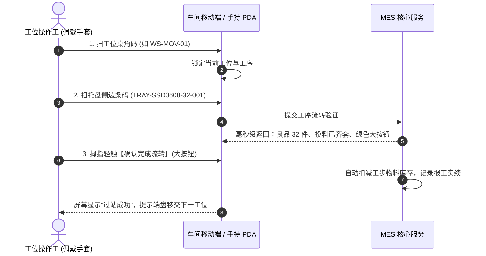

# 8. 管状电机动子 32 件标准齐套配盘单与流转卡模板

> **文件性质**：车间物理现场实操规范与打印级表单标准  
> **适用对象**：管状直线电机动子总成（`SEM-MOV-SSD0608H` / ERP 原码 `SSD0608H`）  
> **实施产线**：直线电机装配线（7 大标准工位）  
> **流转单元**：1 托盘 = 32 件（烘箱工位支持 2 盘 = 64 件合批）  

---

## 一、 设计背景与现场痛点穿透

在对车间一线工人的深度调研中，工人反馈了三个决定实操成败的关键事实：
1. **配料端最大痛点**：“按订单拿物料，经常少物料”（如少端盖螺丝、少引线套管），工人做到一半被迫停工找料；
2. **操作端环境现实**：桌面空间狭窄摆满工具与胶水，工人双手戴手套且沾有胶水酒精，**严禁放置电脑，严禁键盘打字**；
3. **物理流转机制**：整单以 32 件为一盘（专用工装托盘），从工位 1 依次向工位 7 手动传递，且**工位 5（烘烤）为 2 盘（64件）合并入炉烘烤 1 小时**。

针对以上现场现实，MES 系统在软件层面之上，必须建立一套**看得见、摸得着、防呆阻断、去键盘化**的现场实物载体：
- **单据一**：《管状电机动子 32件/64件 齐套配盘发料单》（仓库端：点齐打勾，未齐不发）；
- **单据二**：《SSD0608H 动子 32 件标准工装托盘流转卡》（随盘端：32格目视点检，7工位扫码交接）；
- **介质三**：《车间 7 大工位台面标识与扫码交接指引》（工位端：桌角二维码，PDA 秒级过站）。

---

## 二、 单据一：《管状电机动子 32件/64件 齐套配盘发料单》

> **使用部门**：PMC 计划部开单 ➔ 仓储部 `WH01 原料主仓` 拣货备料 ➔ 发往 `WH02 线边仓`（761 动子工位暂存位）  
> **执行军规**：**11 项物料必须 100% 齐套方可放行出库**。若有任一项短缺，发料员直接拒签，杜绝半成品上线窝工。

```
==================================================================================================
                     【管状电机 SSD0608H 动子 32件/64件 标准齐套配盘发料单】
发料单号: ISS-20260917-001          发料类型: 生产工单标准配盘        开单日期: 2026-09-17
生产工单: WO-SSD0608H-26091601       生产批号: LOT20260916-32         配盘模式: [√] 32件单盘  [ ] 64件双盘
产出品物料: SEM-MOV-SSD0608H 管状电机动子总成                          目标线边: WH02 线边仓 (暂存位 761)
==================================================================================================
序号 | 投料编码            | 物料名称与规格           | 单件定额 | 32件单盘定额 | 64件双盘定额 | 拣料库位    | 实发数 | 仓库复核
---|-------------------|------------------------|---------|-------------|-------------|------------|-------|--------
 1 | MAT-DQ-COIL-0608T | 薄线圈 (5.8~5.9mm)     | 7 个    | 224 个      | 448 个      | WH01-LOC717| _____ | [ ] 齐 
 2 | MAT-DQ-COIL-0608H | 厚线圈 (6.0mm)         | 5 个    | 160 个      | 320 个      | WH01-LOC717| _____ | [ ] 齐 
 3 | MAT-HG-GLUE-AB    | 线圈糊制专用 A/B 胶    | 0.002 KG| 0.064 KG    | 0.128 KG    | WH01-LOC718| _____ | [ ] 齐 
 4 | MAT-CL-TAPE-HIGH  | 分组耐热高温绝缘胶带   | 0.10 米 | 3.20 米     | 6.40 米     | WH01-LOC718| _____ | [ ] 齐 
 5 | MAT-DQ-WIRE-3C    | 三色超柔电机引线 (红黄白)| 0.30 米 | 9.60 米     | 19.20 米    | WH01-LOC717| _____ | [ ] 齐 
 6 | MAT-JC-TUBE-HEAT  | 黑色耐热热缩套管       | 0.05 米 | 1.60 米     | 3.20 米     | WH01-LOC716| _____ | [ ] 齐 
 7 | MAT-WJ-CASE-0608  | 铝合金外壳 (SSD0608)   | 1 个    | 32 个       | 64 个       | WH01-LOC716| _____ | [ ] 齐 
 8 | MAT-WJ-CAP-0608   | 前后端盖副 (1前1后)    | 2 个    | 64 个       | 128 个      | WH01-LOC716| _____ | [ ] 齐 
 9 | MAT-WJ-SCREW-M1   | 端盖紧固微型螺丝       | 4 颗    | 128 颗      | 256 颗      | WH01-LOC716| _____ | [ ] 齐 
10 | MAT-HG-GLUE-GLASS | 出线孔密封绝缘玻璃胶   | 0.001 KG| 0.032 KG    | 0.064 KG    | WH01-LOC718| _____ | [ ] 齐 
11 | MAT-HG-GLUE-EP06  | 黑色环氧树脂灌封胶     | 0.015 KG| 0.480 KG    | 0.960 KG    | WH01-LOC718| _____ | [ ] 齐 
==================================================================================================
【齐套校验确认】
1. 仓库拣料员签名: _______________   配盘完成时间: 2026-09-17 ____:____   齐套核验: [ ] 100%齐套无误
2. 车间接收员签名: _______________   接收确认时间: 2026-09-17 ____:____   实物核对: [ ] 准确无缺件
注：本单随物料实物盘一同移交至直线电机装配线工位 1 线边暂存台。
==================================================================================================
```

---

## 三、 单据二：《SSD0608H 动子 32 件标准工装托盘流转卡》

> **使用部门**：随托盘实物在 7 个工位之间逐站传递  
> **卡片规格**：A5 硬质防水覆膜插卡（插在专用工装托盘侧边卡槽内）  
> **核心机制**：
> 1. **32 格目视点检矩阵**：工人做完直接目视清点，一格一物；
> 2. **工位 4 待修池解耦**：若手摇反电测异常，工人用红笔在对应序号画 `X`，良品 31 件直接放行下流，异常件取下放入【线边待修盒】，绝不堵死整条线！

```
==================================================================================================
                 【管状电机 SSD0608H 动子 32 件标准工装托盘流转卡】
托盘条码: [|||||||||||||||||||||||||||||||||||]       卡片编号: TRAY-SSD0608-32-001
           TRAY-SSD0608-32-001                       产品型号: SEM-MOV-SSD0608H (动子)
工单编号: WO-SSD0608H-26091601                        生产批次: LOT20260916-32
计划数量: 32 件                                       工艺路线: ROUTE-MOV-SSD06 (7工步流水线)
==================================================================================================
【32 件工装托盘实物点检槽位矩阵】（目视防呆：一机一槽，异常画 X 并注明原因）
[ 01 ]  [ 02 ]  [ 03 ]  [ 04 ]  [ 05 ]  [ 06 ]  [ 07 ]  [ 08 ]
[ 09 ]  [ 10 ]  [ 11 ]  [ 12 ]  [ 13 ]  [ 14 ]  [ 15 ]  [ 16 ]
[ 17 ]  [ 18 ]  [ 19 ]  [ 20 ]  [ 21 ]  [ 22 ]  [ 23 ]  [ 24 ]
[ 25 ]  [ 26 ]  [ 27 ]  [ 28 ]  [ 29 ]  [ 30 ]  [ 31 ]  [ 32 ]
--------------------------------------------------------------------------------------------------
异常脱扣记录栏（放入线边待修盒）:
[ ] 无异常，32件全良品流转
[ ] 异常脱扣: 槽位编号 [____], 发生工位 [____], 不良现象 [______________], 本盘良品转下道 [____] 件
==================================================================================================
【7 大工位逐站流水作业交接签章】
序 | 工位名称与编码          | 工序重点控制指标               | 接收时间 | 完工良数 | 操作工签名 | PDA扫码确认
---|----------------------|------------------------------|---------|---------|-----------|------------
 1 | 工位1：线圈糊制       | 7薄5厚穿杆固定，尺寸 71.8mm   | __:__   | 32 件   | _________ | [ ] 已扫码
   | `WS-MOV-01`          | AB胶点涂，干透前严禁受力      |         |         |           | 
---|----------------------|------------------------------|---------|---------|-----------|------------
 2 | 工位2：线圈分组       | 尾部并接，头部红黄白三相引出   | __:__   | 32 件   | _________ | [ ] 已扫码
   | `WS-MOV-02`          | 高温绝缘胶带缠紧包平          |         |         |           | 
---|----------------------|------------------------------|---------|---------|-----------|------------
 3 | 工位3：引线焊接       | 三色引线焊接牢固，无假焊虚焊   | __:__   | 32 件   | _________ | [ ] 已扫码
   | `WS-MOV-03`          | 热缩套管热风枪吹紧收口        |         |         |           | 
---|----------------------|------------------------------|---------|---------|-----------|------------
 4 | 工位4：组装反测       | 装前后端盖上螺钉，玻璃胶封孔   | __:__   | ____ 件 | _________ | [ ] 已扫码
   | `WS-MOV-04`          | 【反电动势手摇测试】平稳无毛刺|         | (不良-1)|           | 
---|----------------------|------------------------------|---------|---------|-----------|------------
 5 | 工位5：灌胶烘烤       | 插专用灌胶棍，注三遍环氧黑胶   | __:__   | ____ 件 | _________ | [ ] 已扫码
   | `WS-MOV-05`          | 【2盘64件合并烘烤 1 小时】    |         |         |           | 炉次: OVEN-____
---|----------------------|------------------------------|---------|---------|-----------|------------
 6 | 工位6：清理修整       | 冷拔棍，刀片削平端盖外溢胶体   | __:__   | ____ 件 | _________ | [ ] 已扫码
   | `WS-MOV-06`          | 工业酒精+无尘纸深度清洁       |         |         |           | 
---|----------------------|------------------------------|---------|---------|-----------|------------
 7 | 工位7：终检打标       | 二楼终测：阻抗/电感/耐压合格  | __:__   | ____ 件 | _________ | [ ] 已扫码
   | `WS-MOV-07`          | 激光打标机打刻 32 个出厂 SN 码 |         |         |           | SN码段: 0001~0032
==================================================================================================
【入库与平账结单】
终检判定: [ ] 合格入库 (32件)      检验员签名: _______________      完成日期: 2026-09-17
入库库位: WH02-LOC731 线边暂存位    入库单号: REC-20260917-001      ERP平账状态: [√] 已自动冲销
==================================================================================================
```

---

## 四、 介质三：《车间 7 大工位台面标识与扫码交接指引》

车间工人佩戴防静电手套、手上常有胶水油污，台面严禁摆放键盘和主机。MES 在每个工位桌角右上角粘贴**大尺寸防水防油覆膜二维码标识牌**。

### 1. 7 大工位桌角标识标贴内容

```
+------------------------------------+------------------------------------+
| 【工位 1 桌角标贴】                | 【工位 2 桌角标贴】                |
| 工位编码: WS-MOV-01                | 工位编码: WS-MOV-02                |
| 工位名称: 步骤一·线圈糊制台        | 工位名称: 步骤二·相序分组台        |
| 作业重点: 7薄5厚 / 尺寸 71.8mm     | 作业重点: 红黄白三相 / 高温胶带    |
| [ 二维码: WS-MOV-01 ]              | [ 二维码: WS-MOV-02 ]              |
+------------------------------------+------------------------------------+
| 【工位 3 桌角标贴】                | 【工位 4 桌角标贴】                |
| 工位编码: WS-MOV-03                | 工位编码: WS-MOV-04                |
| 工位名称: 步骤三·引线焊接台        | 工位名称: 步骤四·组装反测台        |
| 作业重点: 烙铁焊引线 / 热缩管      | 作业重点: 端盖封胶 / 反电动势手测  |
| [ 二维码: WS-MOV-03 ]              | [ 二维码: WS-MOV-04 ]              |
+------------------------------------+------------------------------------+
| 【工位 5 桌角标贴】                | 【工位 6 桌角标贴】                |
| 工位编码: WS-MOV-05                | 工位编码: WS-MOV-06                |
| 工位名称: 步骤五·灌胶烘烤台        | 工位名称: 步骤六·修整深洁台        |
| 作业重点: 灌黑胶 / 64件合炉烘烤1h  | 作业重点: 刀片削端盖 / 酒精深洁    |
| [ 二维码: WS-MOV-05 ]              | [ 二维码: WS-MOV-06 ]              |
+------------------------------------+------------------------------------+
| 【工位 7 桌角标贴（二楼）】        |                                    |
| 工位编码: WS-MOV-07                | 标贴物理规格:                      |
| 工位名称: 步骤七·终检打标台        | - 材质: 亚银防水防油耐刮不干胶     |
| 作业重点: 阻抗耐压电测 / 激光打SN  | - 尺寸: 80mm x 50mm                |
| [ 二维码: WS-MOV-07 ]              | - 位置: 工位台面右上角水平贴附     |
+------------------------------------+------------------------------------+
```

### 2. 车间一线 0.5 秒极简扫码手势（去键盘化）



---

## 五、 工位 5“双盘 64 件合炉”与工位 4“待修盒”特殊控制规则

### 1. 工位 5：64 件双盘合并烘烤机制
- **物理现实**：单盘 32 件灌黑胶后，若单独开炉烘烤 1 小时极为浪费电能且打乱节拍。车间常规操作是将相继完成的 **2 个托盘（`TRAY-SSD0608-32-001` 与 `TRAY-SSD0608-32-002`，合计 64 件）** 同时推入烘箱，设定 1 小时烘烤倒计时；
- **系统处理**：在 MES 报工系统中，工位 5 支持“合批过站”：扫入第一个托盘码后提示“等待合批或直接开炉”，扫入第二个托盘码后，两张流转卡自动绑定同一炉次号（如 `OVEN-260917-01`），烘烤完成后两盘同步放行至工位 6。

### 2. 工位 4：线边待修盒（-1 不堵线）机制
- **物理现实**：步骤四组装后必须进行反电动势手测，若 32 件中有 1 件出现反电波形异常或相间短路，工人绝不应停线等待维修；
- **处理步骤**：
  1. 工人在托盘流转卡对应槽位（如 `[ 17 ]`）用红笔划 `X`；
  2. 将该件异常动子取出，放入桌边的红盒【线边待修盒】；
  3. PDA 报工界面点击【异常 -1】，良品数变为 `31`；
  4. 托盘带着 31 件良品正常流入工位 5，线体流动零阻滞；
  5. 不忙时，返修工人在待修盒调取该件重新排障修复，合格后由工位 4 补扫入后续批次补单。

---

## 六、 总结与现场落地步骤

```
[仓库备料 WH01] ➔ 凭配盘单齐套配发 11 项物料 ➔ 移交 WH02 线边暂存台
       ↓
[工位 1 线圈糊制] ➔ 插入 32 件托盘流转卡 ➔ 扫码开始流水线流转
       ↓ (工位 2 ➔ 工位 3 ➔ 工位 4)
[工位 4 反电测试] ➔ 若有不良放入【待修盒】(-1)，良品继续流转
       ↓
[工位 5 灌胶烘烤] ➔ 2 盘 64 件合炉入箱，烘烤 1 小时
       ↓ (工位 6 清理削平)
[工位 7 二楼终测] ➔ 阻抗/耐压电测合格 ➔ 激光打标机自动赋码 32 个 SN
       ↓
[完工入库 WH02] ➔ 扫码完工入库 ➔ 异步单向回写德米萨 ERP 平账 (+32 冲销负库存)
```
