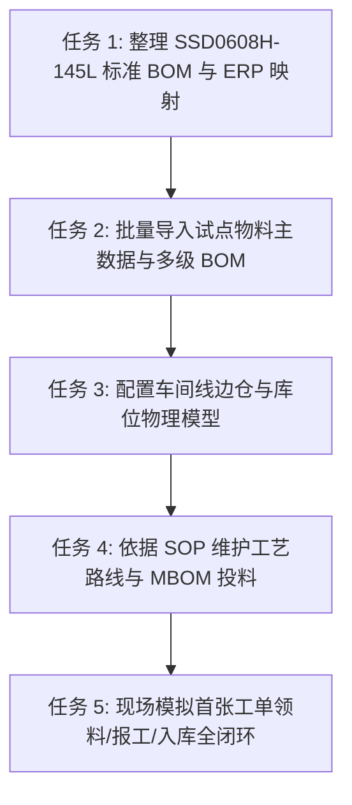
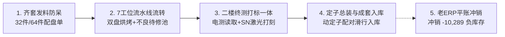

# 4. 当前实施状态与下阶段推进清单

> **【AI 与开发者接续指引】**  
> 本文档是当前项目的**第一手现场上下文与推进路标**。后续无论是开发者自己查阅，还是新的 AI 对话会话接续工作，**请首先阅读本文档**，即可迅速掌握项目最新进度、环境配置并立即开始执行下一步任务，无需从头摸索。

---

## 一、 系统环境与核心运行参数

| 项目/组件 | 配置与坐标 | 备注/凭证 |
| :--- | :--- | :--- |
| **系统架构** | 基于芋道源码 (Yudao / ruoyi-vue-pro) 的自研轻量级 MES | 前后端分离架构 |
| **前端技术栈** | Vue 3 + Vite + Element Plus + Pinia | 运行于本地端口 `80` 或 `5173` |
| **后端技术栈** | Spring Boot 3.x + Spring AI 1.1.8 + MyBatis Plus | 运行于本地端口 `48080` |
| **本地 Docker 数据库** | MySQL 8.0 容器，主机端口映射为 **`3307`** | 地址: `127.0.0.1:3307` 用户名: `root` 密码: `123456` 库名: `ruoyi-vue-pro` |
| **本地 Redis 缓存** | 容器运行于 `127.0.0.1:6379` | 默认空密码或 `123456` |
| **上游 ERP 系统** | 德米萨 ERP (老进销存) | 采用防腐层对接，只读拉取，不修改 ERP 底层 |
| **项目工作区路径** | `d:\mes\mes\` | 包含前端、后端、SQL及完整文档 |

---

## 二、 当前里程碑完成状态盘点

截至 2026 年 9 月 12 日，**阶段一：基础建模与分类重构** 已 100% 完成：

- [x] **本地研发与部署环境打通**：
  - 解决了 Vite、pnpm、Nginx History 模式、Spring AI 与 Alibaba BOM 依赖冲突等 11+ 项底层环境踩坑（详见 [1. 本地环境搭建与部署踩坑记](file:///d:/mes/mes/docs/02-%E5%AE%9E%E6%96%BD%E8%BF%9B%E5%BA%A6/1.%20%E6%9C%AC%E5%9C%B0%E7%8E%AF%E5%A2%83%E6%90%AD%E5%BB%BA%E4%B8%8E%E9%83%A8%E7%BD%B2%E8%B8%A9%E5%9D%91%E8%AE%B0.md)）；
- [x] **德米萨 ERP 业务痛点穿透诊断**：
  - 查明 ERP 负库存根源（销售强制出库扣减，但车间下线从未录入完工入库单）；
  - 厘清外购玻璃码盘 vs 自制光栅环、整机 vs 动定子套件、编码器工具与非实物模版费的界限（详见 [2. 德米萨ERP数据摸底与负库存根因诊断](file:///d:/mes/mes/docs/02-%E5%AE%9E%E6%96%BD%E8%BF%9B%E5%BA%A6/2.%20%E5%BE%B7%E7%B1%B3%E8%90%A8ERP%E6%95%B0%E6%8D%AE%E6%91%B8%E5%BA%95%E4%B8%8E%E8%B4%9F%E5%BA%93%E5%AD%98%E6%A0%B9%E5%9B%A0%E8%AF%8A%E6%96%AD.md)）；
- [x] **物料分类 2~4 字极简短名重构**：
  - 确立以“原材料（机加五金/电气传感/胶水绝缘/包装辅料/电子元件）”、“半成品（直线组件/旋转自制/PCBA板/自制线束/光栅组件）”、“产成品（电机/模组平台/驱动系统/编码器/成品线缆）”为主干的规范架构；
- [x] **数据库分类字典全量自动化入库**：
  - 编写 [init_mes_item_type_servo.sql](file:///d:/mes/mes/sql/init_mes_item_type_servo.sql) 并在本地 3307 数据库执行成功，73 个层级节点全部激活，前端分类树测试展示正常（详见 [3. 物料分类极简短名重构与数据库注入](file:///d:/mes/mes/docs/02-%E5%AE%9E%E6%96%BD%E8%BF%9B%E5%BA%A6/3.%20%E7%89%A9%E6%96%99%E5%88%86%E7%B1%BB%E6%9E%81%E7%AE%80%E7%9F%AD%E5%90%8D%E9%87%8D%E6%9E%84%E4%B8%8E%E6%95%B0%E6%8D%AE%E5%BA%93%E6%B3%A8%E5%85%A5.md)）；
- [x] **文档中心双目录系统化整理**：
  - 分离为 `01-设计方案` 与 `02-实施进度`，且全部按推进次序数字化编号。

---

## 三、 下一阶段任务推进清单（阶段二：物料主数据与 MBOM 贯通）

后续推进**严禁搞全厂几千种物料的一刀切全量导入**，必须严格遵循“**单品试点法**”：集中打通 1 款出货量大、结构清晰、覆盖典型的核心产品：**管状直线电机（含管状电机动子与定子磁轴）**，走通全流程。

### 试点产品技术物料结构（对齐 ERP 负库存第一主力与现场 0608 SOP）
- **产成品整机**：管状直线电机整套配对（`PRD-SSD0608H-145L`，ERP 账面负库存 -10,289 套之王牌产品）
- **动子总成**：`SEM-MOV-SSD0608H`（外壳、线圈7薄5厚、端盖、螺丝、电机引线、套管、AB胶、高温胶带、玻璃胶、环氧灌封胶）
- **定子磁轴**：`SEM-STA-SS06-145L`（精密钢管、端子堵头、环形强磁钢、瞬干胶 ➔ 外发机加商精磨外圆及端部加工）

### 具体任务排期表（Task Breakdown）

| 序号 | 任务名称 | 具体行动细节与执行指令 | 交付物/完成标志 |
| :---: | :--- | :--- | :--- |
| **Task 1** | **整理管状直线电机标准物料清单与编码映射** | 1. 动子组件：铝壳、线圈(7薄5厚)、端盖、螺丝、引线、套管、AB胶、高温胶带、玻璃胶、环氧灌封胶； 2. 定子磁轴：钢管、端子、强磁钢、瞬干胶； 3. 锁定老 ERP 负库存第一大主力 `SSD0608H-145L`（动子 `SSD0608H` + 定子 `SS06-145L`）； 4. 建立独立映射表 `mes_md_item_mapping` 录入老 ERP 编码映射，死守领域纯洁。 | ✅ **已完成**：产出规范防腐映射表与数据字典对齐。 |
| **Task 2** | **批量导入试点物料主数据档案与 BOM** | 编写并生成自动化注入脚本 [init_mes_tubular_motor_pilot.sql](file:///d:/mes/mes/sql/init_mes_tubular_motor_pilot.sql)。 - 写入 `mes_md_item`：整机 (5101)、动子 (5102)、定子 (5103) 及 15 项核心原辅料； - 写入 `mes_md_product_bom`：建立整机 ➔ 动定子 ➔ 原辅料的多级制造 BOM； - 写入 `mes_md_item_mapping`：建立对德米萨 ERP 的单向映射。 | ✅ **已完成**：已在 3307 数据库执行落盘，前端树形展示验证通过。 |
| **Task 3** | **配置车间物理仓储模型（三级仓位）** | 在 `mes_wm_warehouse`、`mes_wm_warehouse_location`、`mes_wm_warehouse_area` 中建立： 1. `WH01 原料主仓`（机械五金、电气线缆、化工绝缘、强磁特管4大库区与库位）； 2. `WH02 直线装配线边仓`（动子工位周转位、定子暂存位，托盘周转流转卡）； 3. `WH03 委外在途仓`（定子外协机加中转位，实物责任隔离）； 4. `WH04 成品立库`（管状电机合格品良品区、FQC待检隔离区）。 | ✅ **已完成**：全套仓储拓扑脚本已直接注入 3307 数据库落盘。 |
| **Task 4** | **维护管状电机工艺路线与制造 BOM (MBOM)** | 严格践行现场 SOP（0608制作流程及注意事项）与流水线传递实况（1人1批1单32件流转）： 1. **动子流水线** (`ROUTE-MOV-SSD06`, 32件/盘)：`101-线圈糊制` ➔ `102-线圈分组` ➔ `103-引线焊接` ➔ `104-组装与固定(含反电测)` ➔ `105-灌胶与烘烤` ➔ `106-清理整理` ➔ `107-终检打标(出SN)`； 2. **定子路线** (`ROUTE-STA-SS06`, 32件/箱)：`108-穿磁点胶` ➔ `109-外协精磨机加` ➔ `110-表磁终检`； 3. **整机路线** (`ROUTE-PRD-SSD06`)：`111-整机滑行配合与包装`； 4. 绑定工序投料 MBOM（11 项原辅料精准对应工序倒冲扣料）。 | ✅ **已完成**：7工序流水线、32件托盘流转与精准MBOM投料已全量在 3307 数据库生效。 |
| **Task 5** | **首张管状电机动子 32 件标准工单实操跑通全闭环** | **【当前唯一核心主线·现场攻坚中】** 1. 坚决聚焦动子（`SEM-MOV-SSD0608H`），暂不扩散定子与整机； 2. 数据库建模与防腐映射已就绪（详见 [5. 实操手册与验证](file:///d:/mes/mes/docs/02-%E5%AE%9E%E6%96%BD%E8%BF%9B%E5%BA%A6/5.%20%E7%AE%A1%E7%8A%B6%E7%94%B5%E6%9C%BA32%E4%BB%B6%E6%B5%81%E6%B0%B4%E7%BA%BF%E9%A6%96%E5%8D%95%E5%AE%9E%E6%93%8D%E9%97%AD%E7%8E%AF%E4%B8%8E%E9%98%B2%E8%85%90%E5%86%99%E5%9B%9E%E9%AA%8C%E8%AF%81.md)）； 3. 现场实操三件套（配盘单、32格托盘卡、7工位桌角码）已设计交付（详见 [8. 方案标准](file:///d:/mes/mes/docs/01-%E8%AE%BE%E8%AE%A1%E6%96%B9%E6%A1%88/8.%20%E7%AE%A1%E7%8A%B6%E7%94%B5%E6%9C%BA%E5%8A%A8%E5%AD%9032%E4%BB%B6%E6%A0%87%E5%87%86%E9%BD%90%E5%A5%97%E9%85%8D%E7%9B%98%E5%8D%95%E4%B8%8E%E6%B5%81%E8%BD%AC%E5%8D%A1%E6%A8%A1%E6%9D%BF.md)）； 4. Uni-app 移动端 MES 菜单与工作台入口已成功激活； 5. **实操攻坚任务**：组织产线工人打印单据下发，进行 32 件实物物理首跑过站！ | 🚀 **现场实操推进中**（主线攻坚，单人报工已搁置） |
| **Task 6** | **车间一线工人实操调研与统一流程定调** | 1. 深入一线访谈获取台面空间、打胶脏污、刀片削端盖、烘箱合批、二楼打标等物理实况； 2. 确认工人固定月薪制（零计件冲突）； 3. **统一流程决策定调**：明确**单人报工暂时搁置**，当前集中全力保障 **32 件统一流水线标准流程运转**！ 4. 确立五大攻坚支柱：免电脑二维码流转、64件双盘合炉烘烤、线边待修池、二楼终测打标、仓库齐套发料。 | ✅ **已完成**：详见 [6. 一线工人实操调研深度提炼与MES落地改造决策](file:///d:/mes/mes/docs/02-%E5%AE%9E%E6%96%BD%E8%BF%9B%E5%BA%A6/6.%20%E4%B8%80%E7%BA%BF%E5%B7%A5%E4%BA%BA%E5%AE%9E%E6%93%8D%E8%B0%83%E7%A0%94%E6%B7%B1%E5%BA%A6%E6%8F%90%E7%82%BC%E4%B8%8EMES%E8%90%BD%E5%9C%B0%E6%94%B9%E9%80%A0%E5%86%B3%E7%AD%96.md)。 |

---

### 阶段三：32 件统一流水线标准流程实地运转（当前核心主线）

| 当前推进任务 | 具体行动细节与交付物 | 责任定位 / 目标 |
| :--- | :--- | :--- |
| **任务 A：开单与齐套发料** | 输出《32件/64件工单齐套发料配盘单》（[设计方案第8篇](file:///d:/mes/mes/docs/01-%E8%AE%BE%E8%AE%A1%E6%96%B9%E6%A1%88/8.%20%E7%AE%A1%E7%8A%B6%E7%94%B5%E6%9C%BA%E5%8A%A8%E5%AD%9032%E4%BB%B6%E6%A0%87%E5%87%86%E9%BD%90%E5%A5%97%E9%85%8D%E7%9B%98%E5%8D%95%E4%B8%8E%E6%B5%81%E8%BD%AC%E5%8D%A1%E6%A8%A1%E6%9D%BF.md)），仓库点料未齐套前拒签，彻底根治“经常少物料”。 | ✅ **规范已交付**，待现场发料实跑 |
| **任务 B：工位 5 双盘烘烤适配** | 制定 2 盘（64件）托盘流转卡合并烘箱入炉规范，烘箱倒计时 1 小时两盘同步放行。 | ✅ **规范已明确**，待烘烤工步执行 |
| **任务 C：工位 4 不良品解耦流转** | 组装反电测异常时，执行在托盘卡对应槽位画 X，放入【线边待修盒】（-1），良品 31 件正常流转不卡线。 | ✅ **规范已明确**，待现场防呆试跑 |
| **任务 D：二楼打标站集成** | 复用二楼打标机现有 PC，打通电测数据读取与激光打标机一机一码 SN 自动触发打刻。 | 🚀 二楼激光打标机联调中 |
| **任务 E：移动端菜单与实操首跑** | Uni-app 移动端工作台 `menu.json` 挂载 MES 模块；下发托盘卡与工位码实物，组织产线进行首次物理实物盘次过站运转！ | 🚀 移动端已挂载，待现场首跑闭环 |

---

## 四、 后续 AI 接续执行指引（Directives for AI Agents）

当新的 AI 会话或开发者接手此项目时，请遵守以下原则：
1. **优先读取此进度文档**：当前推进重心已全面锁定在 **【阶段三：32 件统一流水线标准流程实地运转】**，单人报工已搁置，切勿分心开发单人模式；
2. **连接本地数据库时**：使用端口 `3307`，密码 `123456`，不得使用默认的 3306 端口；
3. **物料分类引用**：直接关联 `mes_md_item_type` 表中已注入的 73 个标准节点 ID；
4. **物料编码规则**：严格继承德米萨 ERP 原有编码，绝不允许在 MES 中私自生造编码导致脱节。
