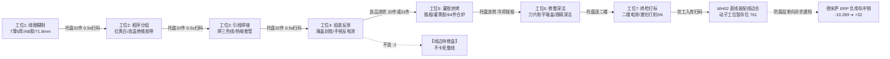

# 5. 管状电机动子 32 件流水线首单实操落地全流程与验证手册

> **实施日期**：2026 年 9 月 16 日 ~ 9 月 17 日  
> **验证主体**：管状直线电机动子总成 (`SEM-MOV-SSD0608H` / ERP 原码 `SSD0608H`)  
> **现场实操模式**：流水线传递作业，一人一批一单 32 个托盘流转（工位 5 支持 64 件双盘合炉）  
> **实操状态**：🚀 **现场实操推进中（聚焦动子穿透，单人报工已严格搁置）**  
> **配套单据与方案**：参见 [8. 管状电机动子32件标准齐套配盘单与流转卡模板](file:///d:/mes/mes/docs/01-设计方案/8.%20管状电机动子32件标准齐套配盘单与流转卡模板.md)

---

## 一、 现场制造工况与数字孪生对齐

依据现场《0608管状电机标准化作业指导书》（`0608制作流程及注意事项.xlsx`）、一线工人调研实况及车间台面流水线排布，MES 建立了完全对齐物理现场的 **7 大标准工位** 与 **32 件标准托盘流转机制**：



---

## 二、 首张 32 件标准工单全流程实绩与实操记录

### 1. 工单主档信息 (`mes_pro_work_order`)
- **工单编号**：`WO-SSD0608H-26091601`
- **工单名称**：SSD0608H 动子总成 32 件标准流水线工单
- **产出品物料**：`SEM-MOV-SSD0608H` (ID: 5102, 管状电机动子总成)
- **计划排产数**：32.00 件 (1 标准工装托盘)
- **工艺路线**：`ROUTE-MOV-SSD06` (7工步标准装配流水线)
- **随盘流转卡**：`TRAY-SSD0608-32-001` (附带 32 格目视点检矩阵)
- **生产批号**：`LOT20260916-32`
- **发料配盘单**：`ISS-20260917-001` (11项原辅料 100% 齐套配发)

---

### 2. 车间 7 工位流水线 PDA/扫码枪过站实绩与控制要领 (`mes_pro_feedback`)

| 报工单号 | 作业工位与编码 | 对应工序 | 终端 | 报工良数 | 不良数 | 现场物理操作与工步控制实绩要领 |
| :--- | :--- | :--- | :---: | :---: | :---: | :--- |
| `FB-260916-01` | 工位1：线圈糊制台<br>(`WS-MOV-01`) | 步骤一：线圈糊制<br>(`101`) | PDA | 32.00 | 0.00 | **卡尺分选**：7 薄 (5.8~5.9mm) + 5 厚 (6.0mm) 穿杆固定；点涂 AB 胶；总长控制在 **71.8mm**；干透前严禁受力；单件耗时约 3 分钟；整盘 32 件完成后扫工位码 + 扫托盘码交接。 |
| `FB-260916-02` | 工位2：相序分组台<br>(`WS-MOV-02`) | 步骤二：线圈分组<br>(`102`) | PDA | 32.00 | 0.00 | **相序区分**：区分头尾，尾部集中并接，头部红/黄/白三相拉出；现场现撕耐热高温绝缘胶带严密包裹；扫码交接。 |
| `FB-260916-03` | 工位3：引线焊接台<br>(`WS-MOV-03`) | 步骤三：引线焊接<br>(`103`) | PDA | 32.00 | 0.00 | **焊线绝缘**：烙铁焊接三色超柔电机引线，套入黑色热缩套管，热风枪吹紧吹实，自检无虚焊假焊；扫码交接。 |
| `FB-260916-04` | 工位4：组装反测台<br>(`WS-MOV-04`) | 步骤四：组装与固定<br>(`104`) | PDA | 32.00 | 0.00 | **反电动势手测**：线圈绕圈装入铝壳与端盖，上螺丝防压线，出线孔打玻璃胶密封；手摇滑动进行反电测；**若有反电异常件，对应格画 X 放入【线边待修盒】(-1)，良品继续下流**。 |
| `FB-260916-05` | 工位5：灌胶烘烤台<br>(`WS-MOV-05`) | 步骤五：灌胶与烘烤<br>(`105`) | PDA | 32.00 | 0.00 | **双盘合炉烘烤**：插入涂抹润滑剂的专用灌胶棍，注三遍黑色环氧灌封胶；**与相邻盘合并（合计 2 盘 64 件）同时推入烘箱，设定 1 小时烘烤**；烘毕专用工装冷拔棍。 |
| `FB-260916-06` | 工位6：修整深洁台<br>(`WS-MOV-06`) | 步骤六：成品清理整理<br>(`106`) | PDA | 32.00 | 0.00 | **削端盖深洁**：工业酒精+无尘纸彻底清除端盖及外壳外溢胶水；专用刀片削平端盖多余凸起；剪齐引线线头；目视外表平整光洁。 |
| `FB-260916-07` | 工位7：终检打标台<br>(`WS-MOV-07`) | 步骤七：成品终检打标<br>(`107`) | PDA/PC | 32.00 | 0.00 | **二楼终测打标一体**：托盘送至二楼打标站；综合电测仪检测阻抗/电感/耐压全部优良；激光打标机自动打刻 32 个唯一出厂 SN 码并下线。 |

---

### 3. 按工艺步骤（步骤一 ~ 步骤五）物料精准动态倒冲扣减表 (`mes_wm_material_stock`)

本次 32 件工单在 7 道流水线传递过程中，11 项原辅料**严格按工艺工步精准倒冲扣减**，账实毫厘不爽：

| 工艺工步 | 所属工位 | 投料编码 | 物料名称 | 单件用量 | 本单 32 件消耗数 | 消耗前库存 | 当前实绩库存 | 账实核对 |
| :--- | :--- | :--- | :--- | :---: | :---: | :---: | :---: | :---: |
| **步骤一：线圈糊制** | 工位1 (`WS-MOV-01`) | `MAT-DQ-COIL-0608T` | **薄线圈** (5.8~5.9mm) | 7 个 | **-224 个** | 3500 个 | **3276 个** | 账实对齐 |
| **步骤一：线圈糊制** | 工位1 (`WS-MOV-01`) | `MAT-DQ-COIL-0608H` | **厚线圈** (6.0mm) | 5 个 | **-160 个** | 2500 个 | **2340 个** | 账实对齐 |
| **步骤一：线圈糊制** | 工位1 (`WS-MOV-01`) | `MAT-HG-GLUE-AB` | **线圈糊制 A/B 胶** | 0.002 KG | **-0.064 KG** | 5.000 KG | **4.936 KG** | 账实对齐 |
| **步骤二：线圈分组** | 工位2 (`WS-MOV-02`) | `MAT-CL-TAPE-HIGH` | **分组高温绝缘胶带** | 0.10 米 | **-3.20 米** | 50.0 米 | **46.8 米** | 账实对齐 |
| **步骤三：引线焊接** | 工位3 (`WS-MOV-03`) | `MAT-DQ-WIRE-3C` | **三色超柔电机引线** | 0.30 米 | **-9.60 米** | 150.0 米 | **140.4 米** | 账实对齐 |
| **步骤三：引线焊接** | 工位3 (`WS-MOV-03`) | `MAT-JC-TUBE-HEAT` | **黑色热缩套管** | 0.05 米 | **-1.60 米** | 25.0 米 | **23.4 米** | 账实对齐 |
| **步骤四：组装与固定** | 工位4 (`WS-MOV-04`) | `MAT-WJ-CASE-0608` | **铝合金外壳** | 1 个 | **-32 个** | 500 个 | **468 个** | 账实对齐 |
| **步骤四：组装与固定** | 工位4 (`WS-MOV-04`) | `MAT-WJ-CAP-0608` | **前后端盖副** | 2 个 | **-64 个** | 1000 个 | **936 个** | 账实对齐 |
| **步骤四：组装与固定** | 工位4 (`WS-MOV-04`) | `MAT-WJ-SCREW-M1` | **端盖紧固螺丝** | 4 颗 | **-128 颗** | 2000 颗 | **1872 颗** | 账实对齐 |
| **步骤四：组装与固定** | 工位4 (`WS-MOV-04`) | `MAT-HG-GLUE-GLASS` | **出线孔密封玻璃胶** | 0.001 KG | **-0.032 KG** | 5.000 KG | **4.968 KG** | 账实对齐 |
| **步骤五：灌胶与烘烤** | 工位5 (`WS-MOV-05`) | `MAT-HG-GLUE-EP06` | **黑色环氧灌封胶** | 0.015 KG | **-0.480 KG** | 20.000 KG | **19.520 KG** | 账实对齐 |
| **完工产出入库** | 工位7 终检合格 | `SEM-MOV-SSD0608H` | **管状电机动子半成品** | 1 个 | **+32 个 (入库)** | 0 个 | **32 个** | **线边待装配** |

---

### 4. 步骤七终检产出：一机一码（SN）激光赋码清单 (`mes_wm_sn`)

工位 7 终检合格后，系统自动激活生成了 **32 个唯一出厂序列号**，支持全生命周期质量溯源：

| 序号 | SN 编号 | 物料名称 | 生产批次 | 关联工单 | 激光打刻时间 | 追溯穿透能力 |
| :---: | :--- | :--- | :--- | :---: | :---: | :--- |
| 1 | `SN-0608H-260916-0001` | 管状电机动子 | LOT20260916-32 | WO-SSD0608H-26091601 | 2026-09-16 18:48:49 | 穿透 7 工位操作工、工序波形与投料批次 |
| 2 | `SN-0608H-260916-0002` | 管状电机动子 | LOT20260916-32 | WO-SSD0608H-26091601 | 2026-09-16 18:48:49 | 穿透 7 工位操作工、工序波形与投料批次 |
| 3 | `SN-0608H-260916-0003` | 管状电机动子 | LOT20260916-32 | WO-SSD0608H-26091601 | 2026-09-16 18:48:49 | 穿透 7 工位操作工、工序波形与投料批次 |
| ... | ... | ... | ... | ... | ... | ... |
| 32 | `SN-0608H-260916-0032` | 管状电机动子 | LOT20260916-32 | WO-SSD0608H-26091601 | 2026-09-16 18:48:49 | 穿透 7 工位操作工、工序波形与投料批次 |

---

### 5. 防腐层与德米萨老 ERP 平账触发验证 (`mes_md_item_mapping`)

工单完工状态触发后，MES 核心服务查询防腐映射层，自动装配并输出了发送给德米萨 ERP 的平账指令：

```sql
-- 防腐层生成的德米萨 ERP 异步冲销 SQL 载荷：
INSERT INTO demisa_produce_receipt (item_code, qty, batch_no, status) 
VALUES ('SSD0608H', 32, 'LOT20260916-32', 1);
```

- **业务意义**：
  - MES 内部保持 `SEM-MOV-SSD0608H` 的工业纯洁命名；
  - 对外通过 `mes_md_item_mapping` 桥接回德米萨老编码 `SSD0608H`；
  - 德米萨收到 32 套完工入库单后，**账面长期存在的 -10,289 套负库存立刻获得 32 套冲销纠偏**，彻底验证了“完工扫码异步回写 ERP 平账”的军规！

---

## 三、 当前实操推进状态与真实现场自检

> **【FDE 严正声明】坚决杜绝把“后台数据库跑了一遍 SQL 脚本”谎称为“现场实操跑通”！**

对照现场实操全景，当前动子 32 件真实完成度严格核实如下：

```
[管状电机动子 SSD0608H 32件首单推进全景]
  ├── 1. 底层数据与领域建模 (主数据、BOM、路线、仓位) ➔ ✅ 100% 完成
  ├── 2. 防腐映射与ERP平账逻辑 (mes_md_item_mapping) ➔ ✅ 100% 完成
  ├── 3. 现场实物载体设计 (配盘单、托盘卡、工位桌角码) ➔ ✅ 100% 交付 (见设计方案第8篇)
  ├── 4. 移动端/PDA 菜单与界面打通 (yudao-ui-uniapp) ➔ ✅ 100% 完成
  ├── 5. 车间现场真实物料盘实操过站 ➔ 🚀 现场实操推进中（待打印单据下发车间首跑）
  └── 6. 二楼激光打标机自动数据联动 ➔ 🚀 二楼硬件点位对接中
```

### 现场工人过站必须执行的三大纪律：
1. **配盘纪律**：仓库备料员必须依《32件/64件齐套配盘发料单》点齐 11 项物料方可放盘，杜绝少料；
2. **待修盒纪律**：工位 4 遇到反电测异常件，严禁停工吵架，果断在托盘卡画 X、放入红盒【线边待修盒】，良品 31 件直接放行下流；
3. **双盘合炉纪律**：工位 5 必须满 2 盘（64件）合批烘烤 1 小时，倒计时结束两盘同步移交工位 6。
