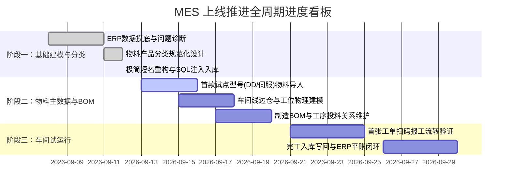

# 伺服与直驱数字化平台 — MES 基础数据录入与实施进度报告

**项目名称**：公司自研轻量级 MES 制造执行系统上线项目  
**当前阶段**：第 1 阶段（基础数据建模与物料分类规范化）  
**报告日期**：2026年9月12日  
**编制人员**：数字化推进组 / 技术研发  
**适用对象**：项目决策层、生产车间主管、工艺工程师、仓储管理部  

---

## 一、 本阶段工作概要与核心里程碑

自项目启动以来，实施组围绕“解决德米萨 ERP 封闭黑盒、车间生产无跟踪、库存账实严重脱节”的战略目标，全面推进自研 MES 系统的基础数据初始化工作。

截至 2026 年 9 月 12 日，**本系统已圆满完成首期基础数据建模、物料产品分类体系重构以及本地数据库的全量注入**，完成了从“概念方案”到“现场系统落地”的关键跨越。

---

## 二、 核心成果与现场重大问题突破

### 2.1 穿透诊断出德米萨 ERP 巨额“负库存”的根源
在对德米萨 ERP 实盘数据调优与分析过程中，系统性识别出车间现场的真实管理困境：
- **现场表象**：ERP 中 `DD马达 类别库存 -3945.0 个`，`编码器工具 类别库存 -9350.0 个`，大量主力出货产品（如 `ICR-20-057I` 结存 -421、`IND140712 光栅磁零位` 结存 -3906）长期处于严重负数状态。
- **根本症结**：销售部接到订单直接在 ERP 里点击“销售出库（强制扣库存）”，但车间现场生产组装完成后**从未走过标准的“完工入库”流程**，导致 ERP 底层只有出库、没有入库，账实严重脱节。
- **MES 解决路径**：必须在 MES 中建立清晰的半成品/成品扫码入库机制，车间测试包装下线即打码入库，自动回传 ERP 冲抵负数。

### 2.2 彻底理顺德米萨 ERP 历史遗留的“大杂烩”物料混杂
通过对 ERP 明细的深度挖掘，纠正了以下三大历史混淆：
1. **外购光学原料 vs 车间装配半成品**：
   - 原 ERP 将外购的玻璃基片（`玻璃码盘` 结存 2055、`镀铬码盘` 结存 632）与车间定心装配校准后的 `光栅环(IESR17)`、`ICDM-11-256 码盘总成` 全部混在“圆光栅”成品分类下。
   - **调整结果**：玻璃毛坯归入 `原材料 > 电气传感 > 光栅码盘`；光栅环归入 `半成品 > 编码器自制组件 > 光栅环`；整套编码器归入 `产成品 > 编码器`。
2. **DD马达整机 vs 无框动定子套件销售形态**：
   - 发现客户大量采购 `ICR-40-0485 动定子`（套件）与 `定子/线圈`（散件备件），不能单纯将其定性为内部在制品。
   - **调整结果**：在产成品 `DD马达` 下设立 `DD马达整机`、`动定子套件`、`定子/线圈外售散件`，兼顾成品销售与半成品装配。
3. **识别并单独设立“编码器工具”专属分类**：
   - 将 ERP 中高达 -9350 结存的 `光栅磁零位`、`端部压块`、`光栅/磁栅安装块`、`校准安装工装` 等配件，统一归入 `产成品 > 编码器 > 编码器工具`，规范出入库管理。
4. **剔除非实物工程费用**：
   - 识别出 `ICDM-30-带孔母版费`（单位：次）属于供应商光刻开模工程费（NRE），打上非实物服务标签，严禁纳入车间生产排产。

### 2.3 完成【短小精炼·一目了然】极简命名重构
摒弃了偏长、学术化的分类定义，全面改用一线工人和工艺人员易辨认的 **2~4 字工业简称**：

| 优化前（偏长繁琐） | 优化后（短小精炼·直观） | 归属大类 | 业务覆盖物料 |
| :--- | :--- | :---: | :--- |
| 机械与五金结构件 | **机加五金** | 原材料 | 轴承、磁铁、铁芯冲片、外壳端盖、转轴机加、型材管料、导轨标件 |
| 电气与传感器件 | **电气传感** | 原材料 | 漆包线、光栅码盘、线缆生料 |
| 化工与绝缘材料 | **胶水绝缘** | 原材料 | 胶水、绝缘材料 |
| 包装与车间辅料 | **包装辅料** | 原材料 | 纸箱泡棉、标贴铭牌、低值耗材 |
| 直线电机组件 | **直线组件** | 半成品 | 动子总成、定子磁轨 |
| 旋转电机自制件 | **旋转自制** | 半成品 | 定子总成、转子总成 |
| PCBA 电控板卡 | **PCBA板** | 半成品 | 驱动板、读数头板、细分板 |
| 直驱与伺服电机 | **电机** | 产成品 | 伺服电机、DD马达、直线电机、音圈电机、磁弹簧 |
| 精密运动模组与平台 | **模组平台** | 产成品 | 直线模组、丝杆模组、平台模组 |
| 驱动与控制系统 | **驱动系统** | 产成品 | 驱动器、细分盒 |
| 编码器与传感测量 | **编码器** | 产成品 | 圆光栅、光栅尺、圆磁环、磁栅尺、编码器工具 |

### 2.4 数据库注入成功与现场验证
- 针对本地 Docker 运行的 MySQL 数据库（端口 `3307`，库名 `ruoyi-vue-pro`，密码 `123456`），成功执行并落地自动化初始化脚本：`init_mes_item_type_servo.sql`；
- **注入结果**：73 个层级节点已全部激活生效，所有父子级关系与 `ITEM/PRODUCT` 校验标识 100% 准确；
- **前端验证**：前端界面刷新即时生效，展开/折叠显示正常，用户已可基于新体系开展物料录入。

---

## 三、 当前面临的关键挑战与规避措施

1. **德米萨 ERP 物料主数据质量不高**：
   - 现状：ERP 历史物料存在少量规格不全、单位混用现象。
   - 措施：在物料导入 MES 前，通过标准 Excel 模板执行前置格式校验与清洗，**保持编码绝对一致**，不合规名称在 MES 中予以标准化。
2. **多层制造 BOM 的工序投料复杂度**：
   - 现状：模组产品包含电机、光栅、导轨等多级装配。
   - 措施：第一期采取“单品试点法”，先集中打通一款主力型号（如 DD马达 ICR 系列），跑顺后再铺开其他复杂模组平台。

---

## 四、 下一步实施推进计划（未来 1~2 周）

| 序号 | 重点任务 | 责任部门/人员 | 预计完成时间 | 关键输出物 |
| :---: | :--- | :---: | :---: | :--- |
| **1** | 选取 1 款主力产品（如 DD马达 ICR-40-0485），整理其完整子件清单 | 计划部 / 技术部 | 2026-09-14 | 《试点产品标准物料明细表》 |
| **2** | 通过系统内置导入功能（`MdItemImportForm`），批量导入第一批零部件主数据 | 数字化推进组 | 2026-09-15 | 物料档案入库，设置批次管理 |
| **3** | 配置生产车间与“线边仓”三级库位（原料仓 ➔ 车间线边仓 ➔ 成品仓） | 仓管部 / 实施组 | 2026-09-17 | 车间物理空间模型建立 |
| **4** | 维护试点产品的工艺路线（工序10~60）与制造 BOM 工序投料点 | 工艺工程师 | 2026-09-19 | 首个可排产的制造 BOM（MBOM） |
| **5** | 在测试机模拟下达一张生产工单，走完“领料 ➔ 报工 ➔ 终检 ➔ 完工入库”全闭环 | 全体推进组 | 2026-09-22 | 验证闭环，准备向公司管理层汇报 |
