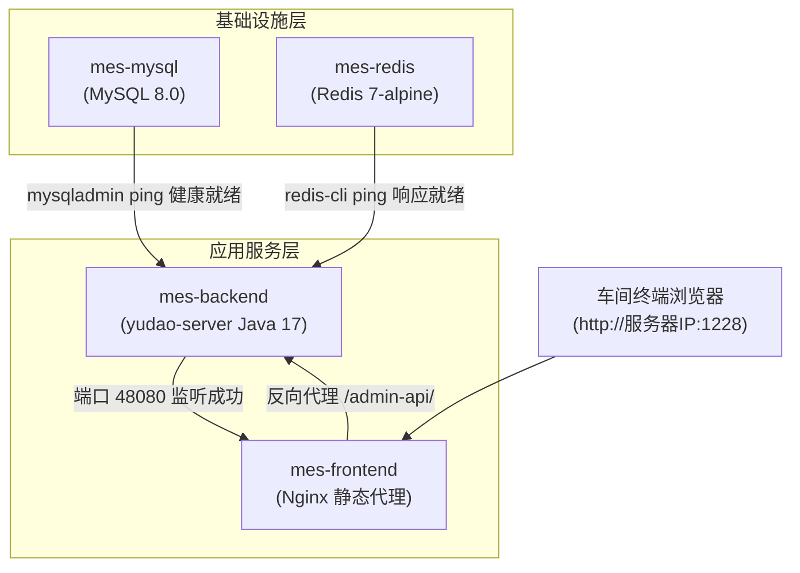

# MES 系统 Docker 后端打包与跨平台全栈容器编排设计方案 (Design Spec)

- **创建日期**：2026-09-10
- **状态**：设计完成（待用户审查）
- **目标系统**：MES 制造执行系统（基于 Spring Boot 3.5.x + JDK 17 + Vue3）
- **适用宿主机**：当前 Windows 开发/测试环境；未来车间服务器（支持 Ubuntu Linux 或 Windows Server）

---

## 1. 概述与核心诉求

为保障 MES 系统能够由开发环境平滑迁移交付至车间本地工控机或高性能服务器，本项目需要建立**标准化、自包含、跨平台（Windows / Linux 兼容）**的容器化打包与全栈编排体系。

### 关键约束与设计原则
1. **已有数据绝对安全**：
   - 用户已对 MySQL 表结构进行了定制改造，编排方案必须支持全量结构导出后初次一键自动初始化导入，后续日常运行严格持久化，永不被覆写。
   - 用户本地已有存有数据的 Redis 容器，编排方案必须支持现有 `dump.rdb` 的平滑迁移挂载。
2. **轻量与高速构建**：
   - 后端采用**“宿主机 Maven 快速编译 + 极简 JRE 17 运行时镜像”**方案，秒级构建镜像，杜绝容器内重复拉取 Maven 依赖的低效与网络问题。
3. **跨平台全兼容（Windows / Ubuntu）**：
   - 相对路径标准 POSIX 规范书写，统一处理 CRLF/LF 换行符问题。
   - 分别提供 Windows 双击批处理脚本（`.bat`）与 Linux Shell 脚本（`.sh`）。
4. **服务端口规范**：
   - 前端 Web 访问端口：**`1228`**（反向代理请求至后端）。
   - 后端 API 端口：`48080`（容器内与宿主机端口）。
   - MySQL 端口：`3306`。
   - Redis 端口：`6379`。

---

## 2. 目录组织结构 (`docker/` 部署套件)

在项目根目录下建立独立的部署工作区 `docker/`，与业务源码解耦：

```text
mes/
├── docker/
│   ├── docker-compose.yml            # 核心编排文件（多服务协同、健康检查、网络与挂载）
│   ├── .env                          # 环境变量配置文件（端口、密码、JVM参数等）
│   ├── .env.example                  # 环境变量配置模板
│   │
│   ├── backend/                      # 后端打包组件
│   │   ├── Dockerfile                # 基于 eclipse-temurin:17-jre-alpine 定制镜像
│   │   ├── build.bat                 # Windows: 一键 mvn package + 构建镜像
│   │   └── build.sh                  # Linux: 一键 mvn package + 构建镜像
│   │
│   ├── frontend/                     # 前端镜像与代理组件
│   │   ├── Dockerfile                # Nginx 镜像构建
│   │   └── nginx.conf                # Nginx 配置（SPA History 模式 + 反向代理 48080）
│   │
│   ├── mysql/                        # 数据库组件
│   │   ├── conf/
│   │   │   └── my.cnf                # MySQL 8.0 调优配置（时区、字符集、不区分大小写）
│   │   ├── init/                     # 首次初始化目录（放入用户导出的最新 SQL 文件）
│   │   └── data/                     # 物理数据挂载（已在 .gitignore 忽略，容器持久化）
│   │
│   ├── redis/                        # 缓存组件
│   │   ├── conf/
│   │   │   └── redis.conf            # Redis 7 配置（AOF持久化、内存淘汰策略）
│   │   └── data/                     # 持久化目录（放入用户现有的 dump.rdb）
│   │
│   ├── start.bat / start.sh          # 一键拉起全套系统
│   ├── stop.bat / stop.sh            # 一键安全停止
│   └── README.md                     # 迁移与部署指引文档
```

---

## 3. 服务编排拓扑与网络架构

### 3.1 容器网桥（Bridge）
所有容器运行于自定义网桥 `mes-net`，容器之间通过服务名（DNS）直接解析与通信：
- 后端连接数据库：`jdbc:mysql://mes-mysql:3306/ruoyi-vue-pro`
- 后端连接缓存：`mes-redis:6379`
- 前端反向代理：`http://mes-backend:48080`

### 3.2 启动时序与健康检查（Health Check）


### 3.3 环境变量与密码配置直观化规范
为避免复杂且易混淆的 Bash 兜底语法（如 `${VAR:-default}` 中 `:-` 容易被误认为负号 `-123456`），编排方案严格遵循**直观化、所见即所得**原则：
- **`docker/.env` 文件**：明文直接书写键值对，例如 `MYSQL_ROOT_PASSWORD=123456`（明确的正整数密码）。
- **`docker-compose.yml` 语法**：采用标准 YAML 键值对映射格式，例如 `MYSQL_ROOT_PASSWORD: "${MYSQL_ROOT_PASSWORD}"`，清晰直观，杜绝隐晦符号。
- **支持就地修改**：如果不使用 `.env` 文件，可直接在 `docker-compose.yml` 中将值直接修改为真实字符串（如 `MYSQL_ROOT_PASSWORD: "你的密码"`），兼容性与可读性达到最优。

---

## 4. 各模块详细设计规范

### 4.1 后端 Dockerfile (`docker/backend/Dockerfile`)
- **基础镜像**：`eclipse-temurin:17-jre-alpine`。
- **环境加固**：
  - 安装 `tzdata` 并固化时区为 `Asia/Shanghai`。
  - 安装 `fontconfig`、`ttf-dejavu`（避免验证码、EasyExcel 导出、报表模块因缺字体发生 NullPointerException）。
- **运行参数**：
  ```dockerfile
  FROM eclipse-temurin:17-jre-alpine
  
  RUN apk add --no-cache tzdata fontconfig ttf-dejavu && \
      ln -snf /usr/share/zoneinfo/Asia/Shanghai /etc/localtime && \
      echo "Asia/Shanghai" > /etc/timezone
  
  WORKDIR /app
  COPY yudao-server.jar app.jar
  
  EXPOSE 48080
  
  ENTRYPOINT ["sh", "-c", "java $JAVA_OPTS -Djava.security.egd=file:/dev/./urandom -jar app.jar"]
  ```

### 4.2 MySQL 8.0 现有表结构迁移与运行规范
- **现有数据迁移指引**：
  1. 在现有开发库导出：`mysqldump -u root -p ruoyi-vue-pro > docker/mysql/init/01-ruoyi-vue-pro.sql`
  2. 镜像初次拉起时，检测到 `/var/lib/mysql` 为空，将自动执行 `init/` 中的全量 SQL。
- **配置规范 (`my.cnf`)**：
  - 强制开启 `lower_case_table_names=1`（表名忽略大小写，保证跨 Windows/Linux 一致性）。
  - 默认字符集 `utf8mb4`，排序规则 `utf8mb4_unicode_ci`。
  - 时区设定 `default-time-zone='+08:00'`。
  - 最大连接数提升至 `500`。

### 4.3 Redis 7 现有数据挂载规范
- **现有数据迁移指引**：
  1. 在现有 Redis 容器执行 `redis-cli save` 刷新 RDB。
  2. 将 `dump.rdb` 文件复制到 `docker/redis/data/dump.rdb`。
  3. `mes-redis` 启动时自动读取现有 key，实现业务会话与缓存无缝恢复。
- **配置规范 (`redis.conf`)**：
  - 启用 `appendonly yes`。
  - 设置最大内存与内存淘汰策略（`maxmemory 1gb`, `maxmemory-policy volatile-lru`）。

### 4.4 前端 Nginx 配置规范 (`docker/frontend/nginx.conf`)
- 监听内部端口 `80`，宿主机通过 Docker Compose 映射对外暴露 **`1228`** 端口。
- 根路径匹配 `/`：`try_files $uri $uri/ /index.html;` 彻底解决 Vue Router History 模式刷新 404 问题。
- 接口匹配 `/admin-api/`：
  ```nginx
  location /admin-api/ {
      proxy_pass http://mes-backend:48080/admin-api/;
      proxy_set_header Host $host;
      proxy_set_header X-Real-IP $remote_addr;
      proxy_set_header X-Forwarded-For $proxy_add_x_forwarded_for;
      proxy_set_header X-Forwarded-Proto $scheme;
      proxy_connect_timeout 60s;
      proxy_read_timeout 300s;
  }
  ```

---

## 5. 跨平台防踩坑设计 (Windows vs Linux)

| 潜在风险点 | 表现及危害 | 本方案预防措施 |
|---|---|---|
| **换行符问题 (CRLF vs LF)** | Shell 脚本或配置文件在 Linux 容器内启动报 `/bin/sh^M: bad interpreter` | 配置文件及 `.sh` 脚本强制采用 `LF` 保存，并增加 `.gitattributes` 锁定。批处理 `.bat` 使用 `CRLF` 保存。 |
| **文件大小写敏感性** | Windows 表名不区分大小写，Linux 默认严格区分大小写，导致联表 SQL 报错 | 在 MySQL 初次初始化挂载时直接通过 `my.cnf` 写入 `lower_case_table_names=1`。 |
| **文件权限问题** | Linux 环境下挂载的数据目录无读写权限导致容器退出 | 在启动脚本中自动增加权限校验与提示，引导或自动配置相应读写权。 |
| **容器内内存溢出 (OOM)** | Java 进程无法识别容器内存限制，导致被操作系统内核 OOM Killer 杀掉 | Java 17 原生支持容器感知，并在 `.env` 中通过 `JAVA_OPTS` 精确分配堆内存（例如 `-Xms1g -Xmx2g`）。 |

---

## 6. 验证与测试计划

1. **构建测试**：
   - 验证 `docker/backend/build.bat` 能否成功构建多模块项目并生成正确的 `yudao-server:latest` 镜像。
2. **中间件启动与数据导入测试**：
   - 验证 `docker compose up -d` 首次拉起时 MySQL 是否成功加载 `init/` 中的自定义 SQL 表结构。
   - 验证 Redis 是否成功加载已放入 `data/` 的持久化缓存数据。
3. **连通性与健康检查测试**：
   - 验证 `mes-backend` 能否在数据库就绪后平滑启动并连接成功，无端口或数据库拒绝错误。
4. **前端访问测试**：
   - 浏览器打开 `http://localhost:1228`，验证登录页展示、验证码生成（字体无异常）以及系统功能操作正常。
